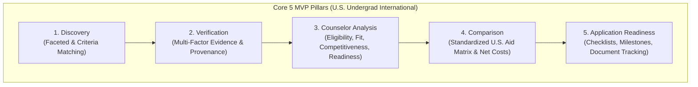
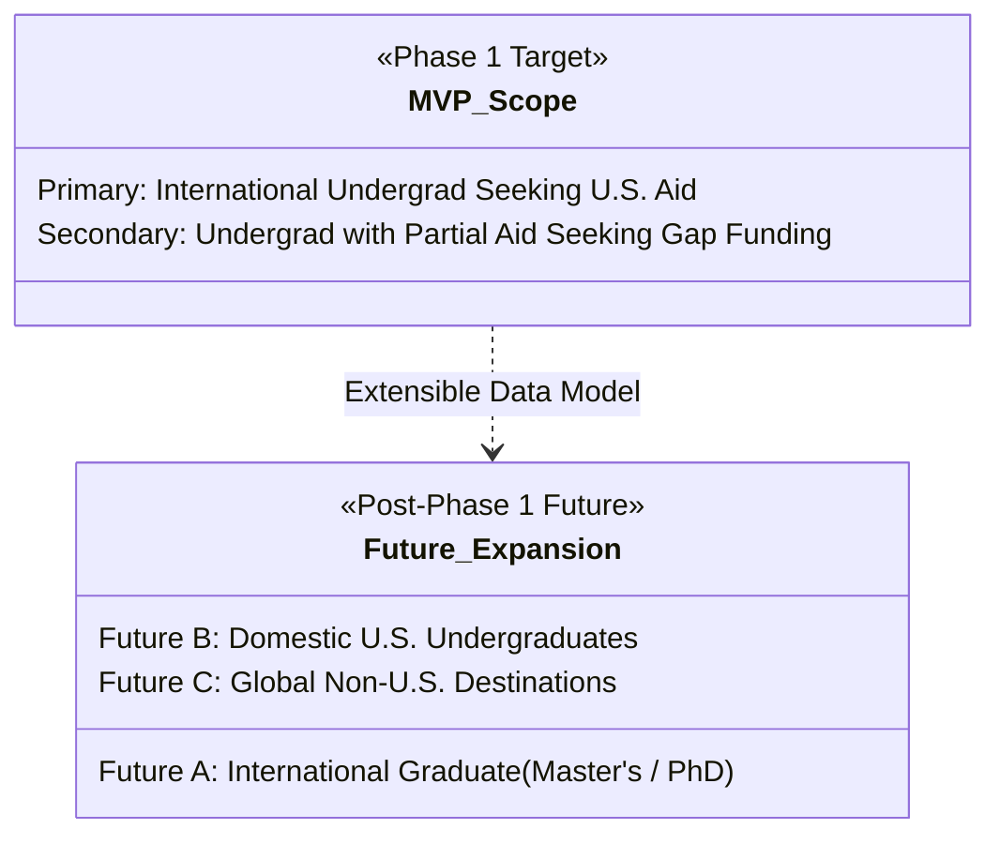

# Product Discovery & Requirements Specification

**Project:** Scholarship Discovery, Verification & Counselor Platform  
**Document:** `docs/phase-0/01-product-discovery-and-requirements.md`  
**Phase:** Phase 0.2 (Final Artifact Synchronization Audit)  
**Primary MVP Scope:** **International Students → U.S. Undergraduate / Bachelor's → Scholarship / Financial-Aid Opportunities**  
**Governing Standard:** `Antigravity Phase 0 — Skills-Aware Addendum.md`

---

## 1. Executive Summary & Problem Space

Financing higher education in the United States is one of the most formidable hurdles for **international undergraduate applicants**. Unlike domestic U.S. students, international applicants face severe structural constraints:
- They are **ineligible for U.S. federal student aid (FAFSA)** and state-sponsored tuition grants.
- Most U.S. colleges practice **need-aware admissions** for international students (a request for financial aid reduces the statistical probability of admission).
- Only a tiny cohort of institutions offer **need-blind admissions** with full-need financial aid to international undergraduates (e.g., Harvard, Princeton, MIT, Amherst, Dartmouth, Bowdoin).
- Private international scholarships and university-specific merit endowments are fragmented across hundreds of institutional subpages, frequently obscured by ambiguous fine print, outdated deadlines, or predatory third-party marketing aggregators.

### The Build Bet (Phase 1 MVP)
> **"International students seeking U.S. undergraduate degrees will adopt and trust this platform if and only if every opportunity is verified against authoritative U.S. institutional or official provider sources, with unambiguous distinction between need-based institutional aid, merit awards, and external scholarships, grounded by an automated counselor that audits hard constraints before the student invests weeks into applications."**

---

## 2. Core Value Proposition & 5 MVP Pillars (U.S. Undergraduate Focus)

The Phase 1 MVP is strictly restricted to **U.S. Undergraduate / Bachelor's funding for International Students** across 5 foundational capabilities:

### Pillar 1: Targeted Discovery
- Faceted filtering tailored exclusively to U.S. undergraduate admissions:
  - Country of citizenship / legal residence (e.g., Sub-Saharan Africa, South Asia, Latin America).
  - Intended undergraduate major / academic discipline (STEM, Humanities, Business, Undecided).
  - Aid Category: Institutional Need-Based Aid, Institutional Merit Scholarship, External Private Foundation, Competitive Fellowship.
  - Institutional Admissions Policy: Need-Blind for International vs Need-Aware for International.
  - Academic Profile Filters: High school GPA (unweighted / converted), Standardized Testing Policies (Test-Optional vs Required).

### Pillar 2: Evidence-Based Verification Engine
- Replaces arbitrary trust thresholds with a **multi-dimensional evidence model**:
  - Primary source status: Tier 1 (Official U.S. University Financial Aid Office / Admissions) vs Tier 4 (Aggregators).
  - Verifiable cycle freshness: Explicit confirmation for the active admissions cycle (e.g., Fall 2026 / 2026–2027 academic year).
  - Zero-Hallucination requirement: Every stated rule must link directly to a verbatim excerpt from the official university or foundation portal.

### Pillar 3: Objective Counselor Analysis
- Structured, non-sycophantic evaluation across 5 decoupled dimensions:
  1. **Eligibility State:** `ELIGIBLE`, `LIKELY_ELIGIBLE`, `INELIGIBLE`, `NEEDS_MORE_INFORMATION`, `CONFLICTING_INFORMATION`, `UNVERIFIED`.
  2. **Fit Assessment:** Qualitative categorization (`STRONG`, `MODERATE`, `WEAK`, `UNKNOWN`).
  3. **Competitiveness Level:** `VERY_HIGH`, `HIGH`, `MODERATE`, `LOWER_KNOWN`, `UNKNOWN`. (No fabricated acceptance percentages; empirical acceptance rates cited only when officially published by the college).
  4. **Readiness Evaluation:** `READY`, `MOSTLY_READY`, `NEEDS_PREPARATION`, `NOT_READY`, `UNKNOWN`.
  5. **Evidence Confidence:** `HIGH`, `MEDIUM`, `LOW`, `UNKNOWN` attached to every deduction based on source quality.

### Pillar 4: Standardized Comparison Matrix
- Direct side-by-side comparison of 2 to 4 U.S. undergraduate opportunities.
- Dissects funding mechanics:
  - Full Cost of Attendance (Tuition, Room, Board, Books, Health Insurance) vs Partial Tuition Only.
  - Need-based grant vs Merit award vs Work-study allocation.
  - Renewal requirements (minimum college GPA maintenance, continuous enrollment).
  - Net application effort (Common App essay, supplemental essays, financial verification forms like CSS Profile / ISFAA).

### Pillar 5: Application Readiness Tracker
- Synthesizes action checklists for complex U.S. college aid requirements:
  - Financial verification documents (International Student Financial Aid Application - ISFAA, CSS Profile, Certification of Finances).
  - Academic credentials (certified transcripts, English proficiency waivers or exam scores: TOEFL/IELTS/Duolingo).
  - Recommendation letters (counselor report, 2 teacher evaluations).

---

## 3. Persona Hierarchy

### Primary Persona (MVP Focus): Kwame — International High School Senior Seeking Full U.S. Aid
- **Background:** High school senior in Accra, Ghana. 3.9 GPA, top 2% of class, SAT 1490. Family cannot afford the $60,000–$85,000/year cost of attendance at U.S. institutions.
- **Goal:** Identify U.S. colleges that offer 100% demonstrated need-based aid to international students (or full-ride competitive merit scholarships like Robertson, Stamps, or Clark Global Scholars).
- **Pain Point:** Misled by aggregator sites listing scholarships that require U.S. citizenship or green cards; unclear whether admission is need-blind or need-aware.
- **JTBD:** *"When I evaluate U.S. colleges, I need to know with 100% certainty whether an international student from Ghana is eligible for full aid, what financial forms are mandatory, and whether applying for aid damages my admission chances."*

### Secondary Persona (MVP Focus): Ananya — International Undergrad with Partial Funding Needing Gap Awards
- **Background:** First-year undergraduate student from India admitted to a U.S. university with an in-state tuition waiver ($15,000 value), but facing an annual $18,000 funding gap for living expenses and health insurance.
- **Goal:** Discover external foundation scholarships, private international grants, and departmental awards open to active F-1 visa undergraduate students in the U.S.
- **Pain Point:** Most external scholarships restrict awards to U.S. citizens or entering domestic freshmen; existing college portals do not filter by visa status.
- **JTBD:** *"When I search for external gap funding, I want to filter strictly for private awards that accept enrolled international undergraduate students on F-1 visas, without wasting time on citizen-only sweepstakes."*

### Future Personas (Explicitly Deferred Post-MVP)
The following personas are documented for long-term platform extensibility, but **MUST NOT** drive Phase 1 implementation, data modeling, or scraper design:
- **Persona F-1 (Future Scope):** International graduate candidate seeking U.S. Master's or PhD fellowships.
- **Persona F-2 (Future Scope):** Domestic U.S. undergraduate seeking Pell Grant supplements and state-based aid.
- **Persona F-3 (Future Scope):** Postdoctoral research fellow seeking international laboratory grants.

---

## 4. Functional Requirements & Measurable Engineering Targets

### Module 1: Targeted Search & Filter (U.S. Undergraduate Only)
- **FR-1.1:** System shall filter strictly across U.S. Undergraduate opportunities by:
  - Applicant citizenship / country of origin.
  - Institutional aid type (`NEED_BLIND_FULL_NEED`, `NEED_AWARE_FULL_NEED`, `INSTITUTIONAL_MERIT`, `EXTERNAL_FOUNDATION`).
  - Award coverage type (`FULL_COST_OF_ATTENDANCE`, `FULL_TUITION`, `PARTIAL_TUITION`, `STIPEND_ONLY`, `ROOM_AND_BOARD`).
  - Minimum GPA threshold and standardized test requirements.
- **FR-1.2:** System shall support semantic queries grounded strictly in international undergraduate criteria (e.g., *"U.S. colleges offering full tuition for African undergraduate engineering students"*).
- **Performance Engineering Targets (To be benchmarked during Phase 1F on a 25-record verified seed dataset):**
  - **Faceted Filter Query Latency Target:** Benchmark target: $p95 \le 350\text{ms}$ on local relational index.
  - **Semantic Vector Query Latency Target:** Benchmark target: $p95 \le 1.5\text{s}$ on local pgvector/in-memory index.

### Module 2: Verification Engine
- **FR-2.1:** Every scholarship record must track:
  - `primary_source_url` (Tier 1 authoritative portal)
  - `source_tier` (`TIER_1_OFFICIAL`, `TIER_2_INSTITUTIONAL_PARTNER`, `TIER_3_REPUTABLE_SECONDARY`, `TIER_4_AGGREGATOR`)
  - `verification_status` (`VERIFIED`, `PARTIALLY_VERIFIED`, `CONFLICTING`, `OUTDATED`, `UNVERIFIED`, `SOURCE_UNAVAILABLE`, `QUARANTINED`)
  - `active_cycle_year` (e.g. "2026-2027")
  - `last_verified_timestamp`
- **FR-2.2:** Multi-deadline tracking:
  - System must store distinct deadlines (`early_decision`, `early_action`, `regular_decision`, `scholarship_priority`, `financial_aid_priority`, `rolling`, `varies_by_institution`).
  - No single deadline may be forced if the provider states dates vary by program.

### Module 3: Counselor Analysis
- **FR-3.1:** Given a structured international student profile, the counselor engine shall evaluate:
  - **Hard Constraints:** Citizenship check, Degree level (= Bachelor's), U.S. Destination, GPA minimum, Deadline cutoff.
  - **Conditional Constraints:** Need-based threshold, admission status prerequisite.
  - **Preferred Attributes:** Alignment with donor mission, leadership, essays.
- **FR-3.2:** Source Anchor Rule: Every conclusion must reference an exact excerpt quote from the primary source.
- **FR-3.3:** Zero Hallucination Rule: If a requirement is not mentioned in the source, the status is set to `UNKNOWN`. Missing information must never be inferred as satisfied.

### Module 4: Comparison Engine
- **FR-4.1:** System shall render side-by-side comparison for 2 to 4 U.S. undergraduate awards.
- **FR-4.2:** Comparison fields must contrast:
  - Award Coverage: Full Tuition vs Room/Board vs Stipend vs Need-based calculation.
  - International Admissions Impact: Need-blind vs Need-aware.
  - Required Deliverables: Common App essay, supplements, CSS Profile, ISFAA, tax declarations.

### Module 5: Application Readiness Tracker
- **FR-5.1:** Checklist generation broken down by requirement category (Financial Verification, Academic Transcripts, Standardized Tests, Recommendations, Essays).
- **FR-5.2:** Status toggles (`NOT_STARTED`, `IN_PROGRESS`, `SUBMITTED`, `VERIFIED_COMPLETE`) persisted per student profile.

---

## 5. Explicit Anti-Scope (Strictly Excluded from Phase 1 MVP)

To maintain focus and avoid scope creep, the following are **strictly excluded** from Phase 1:

1. ❌ **Graduate & Postdoctoral Coverage:** No Master's, PhD, or Postdoc programs in Phase 1.
2. ❌ **Non-U.S. Destination Countries:** No UK, Germany, Canada, Australia, or Asian programs in Phase 1.
3. ❌ **Domestic U.S. Primary Focus:** No FAFSA-dependent state aid or domestic-only scholarships in the initial seed catalog.
4. ❌ **Automated Application Submission (Auto-Appliers):** No automated submission scripts or bot application fillers.
5. ❌ **Visa & Legal Counsel Automation:** The platform does not process F-1 visa applications, I-20 issuances, or offer legal advice.
6. ❌ **AI Essay Ghostwriting:** The platform analyzes prompts and outlines thematic criteria, but will not draft student essays.
7. ❌ **Full Autonomous Chatbot:** Interaction is delivered via structured Counselor Dossiers and targeted interactive prompts, not an open-ended autonomous chat agent.
8. ❌ **Native Mobile Applications:** Desktop and mobile web responsive only.
