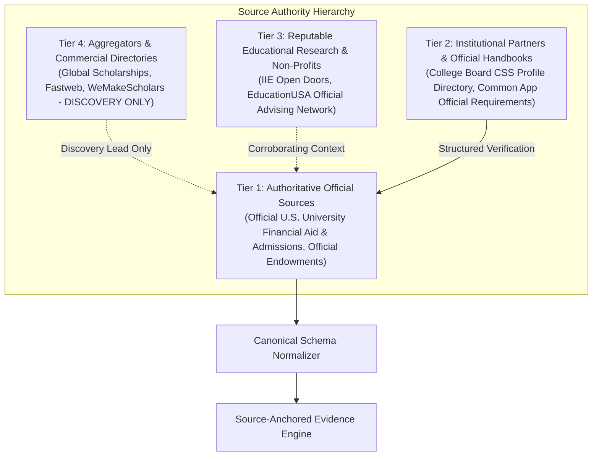
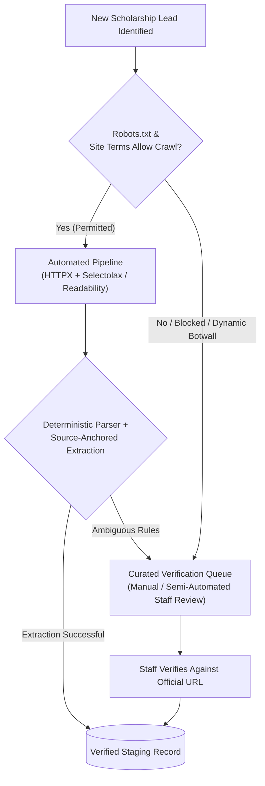

# Data Sources & Ingestion Pipeline Research

**Project:** Scholarship Discovery, Verification & Counselor Platform  
**Document:** `docs/phase-0/02-data-sources-and-ingestion-research.md`  
**Phase:** Phase 0.2 (Final Artifact Synchronization Audit)  
**Primary Focus:** **U.S. Undergraduate Financial Aid & International Scholarships**  
**Governing Standard:** `Antigravity Phase 0 — Skills-Aware Addendum.md`

---

## 1. U.S. Undergraduate Financial Aid & Scholarship Source Hierarchy

To eliminate misleading listings and protect students from stale data, the ingestion pipeline enforces a strict **four-tier source authority hierarchy**. Third-party aggregators are never treated as authoritative.



### Tier 1 — Authoritative Official Sources (Mandatory for Verification)
- **Institutional Financial Aid Portals:**
  - Official financial aid subdomains of accredited U.S. degree-granting colleges (e.g., `financialaid.dartmouth.edu`, `admissions.clarku.edu`, `berea.edu/admissions/financial-aid`).
  - Institutional merit scholarship programs (e.g., *Emory University Scholars Program*, *University of Miami Stamps Scholars*, *Boston University Trustee Scholarship*).
  - Endowed independent foundation programs tied to U.S. undergraduate matriculation (e.g., *Robertson Scholars Leadership Program* for Duke/UNC, *Davis UWC Scholars Program*).
- **Official U.S. Bilateral / Government Programs:**
  - *EducationUSA Opportunity Funds Program* (Department of State funding for high-achieving, low-income international students to cover upfront U.S. application and testing costs).
  - *Global UGRAD (Global Undergraduate Exchange Program)*.

### Tier 2 — Institutional Partners & Standardized Aid Documentation
- College Board International CSS Profile participating institutions directory (`cssprofile.collegeboard.org`).
- Common Application official international student fee waiver and aid reporting documentation.
- International Student Financial Aid Application (ISFAA) standard forms published by institutional financial aid offices.

### Tier 3 — Reputable Secondary Sources (Corroboration)
- Institute of International Education (IIE) Open Doors reports documenting colleges enrolling international undergraduates with institutional aid.
- Vetted non-profit educational advising organizations (e.g., EducationUSA advising handbooks).

### Tier 4 — Commercial Aggregators & Directories (Discovery Only)
- Platforms such as *Global Scholarships*, *InternationalScholarships.com*, and *WeMakeScholars*.
- **Role in System:** **Discovery leads only.** Information from Tier 4 directories is treated as `UNVERIFIED`. The ingestion engine extracts the lead and immediately follows the link to verify the opportunity directly against the Tier 1 primary institutional URL. No scholarship is marked `VERIFIED` from an aggregator alone.

---

## 2. Scraping Ethics, Compliance & Ingestion Protocols

### 2.1 Legal & Ethical Crawling Principles
1. **Respect for Access Restrictions & Robots.txt:** The platform strictly honors `robots.txt` directives, disallow rules, and crawl-delay intervals.
2. **No Circumvention or Anti-Bot Bypasses:** The crawler will **never** attempt to bypass Cloudflare challenges, Akamai bot guards, CAPTCHAs, or authentication walls. Engineering bypass tools (such as automated proxy rotation or CAPTCHA solvers) is strictly prohibited.
3. **Identification & Transparency:** Every automated request carries an identifiable User-Agent:
   `User-Agent: InternationalScholarshipResearch/1.0 (+https://platform-domain.org/crawler-info; bot@platform-domain.org)`
4. **Adaptive Throttling & Rate Limiting:** Maximum 1 request every 3–5 seconds per target domain with exponential backoff on HTTP 429.
5. **Bandwidth Minimization:** Uses HTTP `HEAD` checks, `If-Modified-Since`, and `ETag` conditional headers to minimize remote server load.

### 2.2 Dual Ingestion Paths: Automated vs Manual Curated



- **Path A (Automated Ingestion):** Applied to institutional pages that permit standard crawling and have static or clean semantic HTML.
- **Path B (Manual / Curated Verification Path):** Applied when an institution's site uses aggressive anti-bot protection, dynamic single-page applications without server rendering, or explicitly restricts automated indexing. In such cases, the system routes the URL to a structured admin verification workflow where an analyst inspects the primary source and confirms criteria manually.

---

## 3. Canonical Schema Normalization (U.S. Undergraduate International)

The canonical schema represents the multi-dimensional reality of U.S. international undergraduate financial aid:

```json
{
  "scholarship_id": "clark-global-scholars-2026",
  "external_id": "clarku-gsp",
  "title": "Global Scholars Program",
  "provider_name": "Clark University",
  "institution_type": "PRIVATE_NONPROFIT_UNIVERSITY",
  "source_authority_tier": "TIER_1_OFFICIAL",
  "primary_source_url": "https://www.clarku.edu/admissions/undergraduate-admissions/tuition-and-aid/scholarships/global-scholars-program/",
  "discovery_source_url": "https://globalscholarships.com/clark-university-scholarships/",
  "academic_year": "2026-2027",
  "degree_level": "BACHELOR",
  "eligible_nationalities": ["ALL_INTERNATIONAL_NON_US_CITIZENS"],
  "ineligible_nationalities": ["US_CITIZENS", "US_PERMANENT_RESIDENTS"],
  "host_institution": "Clark University, Worcester, MA, USA",
  "aid_category": "INSTITUTIONAL_MERIT_NEED_HYBRID",
  "funding_breakdown": {
    "funding_type": "PARTIAL_TUITION_PLUS_STIPEND",
    "tuition_coverage": "PARTIAL",
    "annual_award_min": 15000,
    "annual_award_max": 25000,
    "currency": "USD",
    "renewable": true,
    "renewal_criteria": "Maintain full-time enrollment and minimum 3.0 cumulative college GPA",
    "room_and_board_included": false,
    "health_insurance_included": false,
    "stipend_included": true,
    "stipend_details": "$2,500 taxable stipend for an approved summer internship"
  },
  "deadlines": [
    {
      "deadline_type": "EARLY_ACTION",
      "deadline_date": "2026-11-15",
      "timezone": "America/New_York",
      "description": "Early Action admission & scholarship consideration deadline",
      "evidence_snippet": "Students must submit the Common Application by November 15 for Early Action."
    },
    {
      "deadline_type": "REGULAR_DECISION",
      "deadline_date": "2027-01-15",
      "timezone": "America/New_York",
      "description": "Regular Decision admission deadline",
      "evidence_snippet": "Regular Decision deadline is January 15."
    }
  ],
  "eligibility_rules": [
    {
      "rule_id": "rule-citizenship",
      "constraint_type": "REQUIRED",
      "field": "citizenship",
      "operator": "NOT_EQUALS",
      "target_value": "US_CITIZEN_OR_PR",
      "evidence_snippet": "Open to first-year international applicants who are not U.S. citizens or permanent residents."
    },
    {
      "rule_id": "rule-academics",
      "constraint_type": "REQUIRED",
      "field": "academic_standing",
      "operator": "DEMONSTRATED_EXCELLENCE",
      "target_value": "High school transcript demonstrating exceptional academic achievement",
      "evidence_snippet": "Candidates must demonstrate outstanding academic performance in secondary school."
    },
    {
      "rule_id": "rule-leadership",
      "constraint_type": "PREFERRED",
      "field": "leadership_community",
      "operator": "CONTAINS",
      "target_value": "Demonstrated potential for leadership in community",
      "evidence_snippet": "Preference is given to students with demonstrated leadership in their schools or communities."
    }
  ],
  "required_deliverables": [
    "Common Application + Clark University Member Questions",
    "Official High School Secondary Transcripts (certified English translation)",
    "Counselor Recommendation Letter",
    "One Teacher Recommendation Letter",
    "CSS Profile or International Student Financial Aid Application (ISFAA)",
    "English Language Proficiency (TOEFL iBT 85+, IELTS 6.5+, or Duolingo 120+)"
  ],
  "verification_metadata": {
    "status": "VERIFIED",
    "last_checked_timestamp": "2026-09-11T18:00:00Z",
    "http_status": 200,
    "content_hash_sha256": "4f9d2b8...",
    "reviewer_type": "AUTOMATED_TIER1_DIRECT"
  }
}
```

---

## 4. Deduplication & Hash Fingerprinting

To ensure consistency when scholarships are indexed across multiple pages:
1. **Deterministic Primary Key:**
   $$\text{Fingerprint} = \text{SHA-256}(\text{Normalized Institution Name} + "|" + \text{Normalized Scholarship Title} + "|" + \text{Academic Year})$$
2. **Cross-Source Discrepancy Flagging:** If an aggregator (Tier 4) lists a deadline or award amount that conflicts with the Tier 1 official URL, the record is marked `CONFLICTING` and flagged for review, while the user-facing UI preferentially presents the Tier 1 official value with an audit note.

---

## 5. Phase 1 Seed Dataset Targets (15–25 Verified U.S. Undergraduate Programs)

The Phase 1 core engine will be implemented and validated against a curated, high-fidelity seed dataset of authentic U.S. undergraduate financial aid programs for international students:

1. **Clark University** — Global Scholars Program (Partial Tuition + Internship Stipend)
2. **Berea College** — No-Tuition Promise & International Housing Grant (Full Tuition + Room/Board)
3. **Dartmouth College** — Need-Blind Full Demonstrated Need Aid for International Undergraduates
4. **Amherst College** — Need-Blind Full Demonstrated Need Aid for International Undergraduates
5. **Harvard University** — Need-Blind Full Demonstrated Need Aid for International Undergraduates
6. **Princeton University** — Need-Blind Full Demonstrated Need Aid for International Undergraduates
7. **Massachusetts Institute of Technology (MIT)** — Need-Blind Full Demonstrated Need Aid
8. **Bowdoin College** — Need-Blind Full Demonstrated Need Aid for International Undergraduates
9. **University of Miami** — Stamps Scholars Program (Full Tuition, Room, Board, Books, Health Insurance)
10. **Emory University** — Emory University Scholars Program (Full Tuition / Partial Tuition Merit)
11. **Boston University** — Trustee Scholarship (Full Tuition & Mandatory Fees)
12. **Davidson College** — John M. Belk Scholarship (Comprehensive Full Cost of Attendance)
13. **Wesleyan University** — Freeman Asian Scholars Program (Full Tuition & Fees for 11 Asian Nations)
14. **Duke University / UNC Chapel Hill** — Robertson Scholars Leadership Program (Full Tuition, Room, Board)
15. **Davis United World College Scholars Program** — Need-based Grants at 99 U.S. Partner Colleges
16. **University of Richmond** — Richmond Presidential Scholarship (Full Tuition)
17. **Vanderbilt University** — Cornelius Vanderbilt Scholarship (Full Tuition + Summer Stipend)
18. **American University** — AU Emerging Global Leader Scholarship (Full Tuition, Room & Board)
19. **University of Notre Dame** — Hesburgh-Yusko Scholars Program (Merit Full Ride)
20. **EducationUSA** — Opportunity Funds Program (Upfront Testing & Application Fee Grants)

---

## 6. Future Expansion Data Sources (Deferred Post-Phase 1)

The following non-U.S. or graduate-level programs are noted for future architectural extensibility, but **MUST NOT** be scraped, parsed, or tested during Phase 1:
- *Future Graduate Examples:* DAAD EPOS (Germany), Erasmus Mundus Joint Masters (EU), Global Korea Scholarship Graduate (GKS), Fulbright Foreign Student Program (Graduate).
- *Future Geographic Destinations:* Canadian U15 undergraduate awards, UK Commonwealth scholarships, Australian destination awards.
