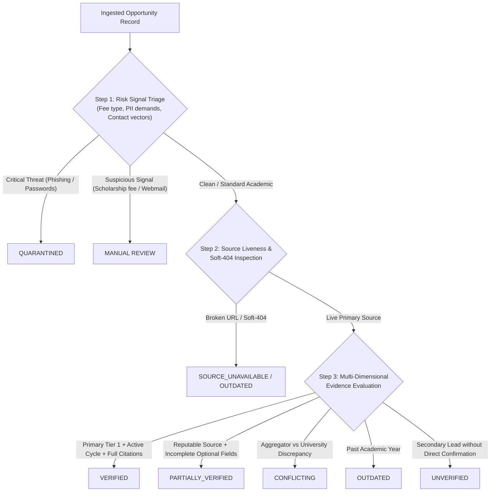
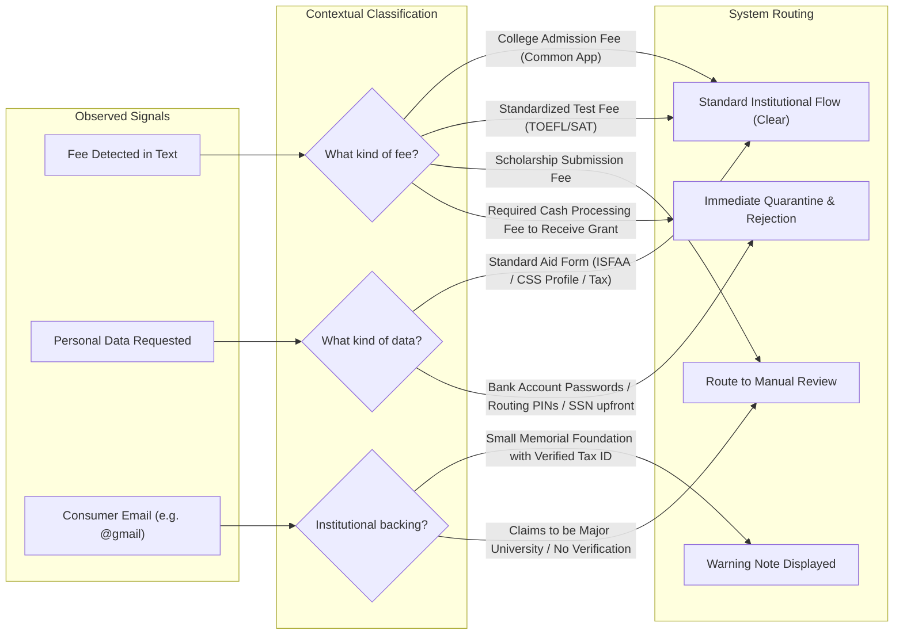
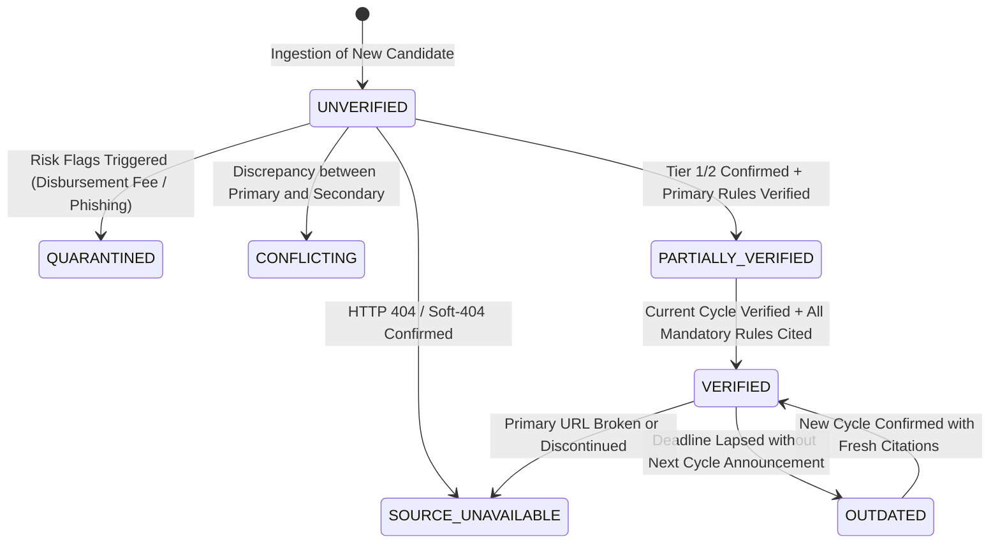

# Verification Engine & Multi-Factor Evidence Architecture

**Project:** Scholarship Discovery, Verification & Counselor Platform  
**Document:** `docs/phase-0/03-verification-and-authenticity-design.md`  
**Phase:** Phase 0.2 (Final Artifact Synchronization Audit)  
**Focus:** **Evidence-Based Authenticity, Risk Triage & Multi-Deadline Verification**  
**Governing Standard:** `Antigravity Phase 0 — Skills-Aware Addendum.md`

---

## 1. Grounded Verification Philosophy

The platform rejects the premise that authenticity can be derived from arbitrary numerical formulas or superficial domain extensions (`.edu`, `.gov`, `.org`).
- A `.edu` domain may host an abandoned student blog from 2018 or an unaccredited student organization contest.
- A `.org` domain may be operated by a commercial lead broker masquerading as a charity.
- A `.com` domain may belong to a legitimate private donor endowment with millions in audited foundation assets.

**Domain extension alone MUST NOT establish authenticity.**

Authenticity is treated strictly as an **evidence-based state** established through primary-source documentation, verifiable current-cycle publishing, and source-anchored citations.



---

## 2. Formal Verification States & Mandatory Evidence Criteria

A scholarship record must be assigned exactly one of the following canonical verification states based on strict evidence criteria:

| Verification State | Evidence Criteria Required for Assignment | System Behavior / Visibility |
|---|---|---|
| **`VERIFIED`** | 1. Direct confirmation against a Tier 1 Authoritative Official Source (Official University Admissions/Financial Aid portal or registered foundation).<br/>2. Explicit text evidence confirming the current/upcoming academic cycle (e.g., 2026–2027).<br/>3. Verbatim source citations anchored to all mandatory eligibility rules and deadlines.<br/>4. Active HTTP 200 status with zero soft-404 signals. | Fully visible in primary search and counselor recommendations with "Verified Official Source" badge. |
| **`PARTIALLY_VERIFIED`** | 1. Official or reputable institutional partner source confirmed.<br/>2. Primary eligibility criteria confirmed with citations.<br/>3. Minor non-critical fields (e.g. renewal GPA details or exact stipend schedule) not yet explicitly corroborated or unstated. | Visible with "Partially Verified — Confirm Details with University" badge. |
| **`CONFLICTING`** | 1. Direct discrepancy discovered between two sources (e.g., Tier 4 aggregator claims full scholarship, but Tier 1 university portal states tuition-only).<br/>2. Discrepancy logged with both conflicting citations. | Suppressed or flagged with explicit conflict alert explaining the contradictory statements. |
| **`OUTDATED`** | 1. Verified in a prior academic cycle (e.g., 2024–2025), but the institution has not yet published dates/terms for the 2026–2027 cycle.<br/>2. Page exists but deadline has elapsed without renewal notice. | Visible only in "Historical / Upcoming Cycles" filter; clearly marked as pending renewal. |
| **`UNVERIFIED`** | 1. Raw lead ingested from directory, press release, or aggregator.<br/>2. Has not yet undergone direct primary-source verification. | Suppressed from public student search; visible only in admin ingestion queue. |
| **`SOURCE_UNAVAILABLE`** | 1. Primary source URL returns persistent HTTP 404, 410, 5xx, or DNS failure across 3 consecutive checks.<br/>2. Or page contains definitive soft-404 indicators ("Page not found", "Program cancelled"). | Excluded from active student search; quarantined for link repair or archival. |
| **`QUARANTINED`** | 1. Severe risk signals identified during automated scan or human audit (credential harvesting, illegal fees, deceptive identity). | Completely isolated and blocked from all student-facing endpoints. |

---

## 3. Risk Signal Triage: Nuanced Fee & PII Analysis

The platform replaces blunt, error-prone rules (`SIGNAL → SCAM`) with a graduated triage architecture:
$$\text{SIGNAL} \longrightarrow \text{RISK FLAG} \longrightarrow \text{EVIDENCE REVIEW} \longrightarrow \text{VERIFICATION STATUS}$$



### 3.1 Contextual Fee Analysis
- **University Admission Fee (Legitimate):** Standard $50–$90 fee required by U.S. university admissions offices (via Common App) to process an undergraduate application. *Action:* `LOW RISK SIGNAL / CLEAR`. (Note: Platform highlights colleges offering international application fee waivers).
- **Standardized Testing Fee (Legitimate):** Third-party fees charged by ETS (TOEFL) or College Board (SAT). *Action:* `LOW RISK SIGNAL / CLEAR`.
- **Scholarship Application Fee (Risk Flag):** A fee charged specifically to enter or apply for a private scholarship. While a tiny minority of artistic competitions legitimately charge portfolio review fees, academic scholarships almost never do. *Action:* `NEEDS REVIEW / MANUAL REVIEW REQUIRED`.
- **Pre-Disbursement / Processing Fee (Fraud Signal):** Demands payment in exchange for "guaranteed award disbursement". *Action:* `QUARANTINED`.

### 3.2 Contextual Information & PII Analysis
- **Standard Institutional Financial Need Documentation:** Requests for family income, asset statements, tax returns, and employer certifications via established forms (ISFAA, CSS Profile). *Action:* `PERMITTED FOR NEED-BASED EVALUATION`.
- **Identity & Financial Exploitation Signals:** Requests for online banking logins, credit card numbers, Social Security Numbers (SSNs), or wire transfers. *Action:* `QUARANTINED`.

*Operational Reality Note:* No automated system can detect 100% of scams. The platform enforces defense-in-depth: automated risk flag detection + human-in-the-loop review for flagged items + a student-facing **"Report Suspicious Opportunity"** button.

---

## 4. Multi-Deadline Architecture & Evidence Modeling

In U.S. undergraduate admissions, a single scholarship program frequently has **multiple distinct deadlines** depending on admissions round, college choice, or applicant residency.

The platform explicitly models multiple deadlines per opportunity and rejects collapsing them into a single date:

```mermaid
classDiagram
    class ScholarshipDeadline {
        +UUID deadline_id
        +UUID scholarship_id
        +DeadlineType deadline_type
        +Date deadline_date
        +String timezone
        +Boolean is_strict_cutoff
        +String context_description
        +String source_evidence_snippet
    }
    <<enumeration>> DeadlineType
    class DeadlineType {
        SCHOLARSHIP_SEPARATE_DEADLINE
        ADMISSION_APPLICATION_DEADLINE
        FINANCIAL_AID_PRIORITY_DEADLINE
        EARLY_DECISION_I
        EARLY_DECISION_II
        EARLY_ACTION
        REGULAR_DECISION
        ROLLING_ADMISSIONS
        PROGRAM_SPECIFIC
        INSTITUTION_SPECIFIC
        COUNTRY_SPECIFIC
        VARIES_BY_PROGRAM
        VARIES_BY_INSTITUTION
        UNKNOWN
    }
```

### Representation Rules:
1. **No False Universals:** If a scholarship states *"Deadlines vary depending on the chosen undergraduate major"*, the system stores `deadline_type = VARIES_BY_PROGRAM` and records the explanation in `context_description`. It does **not** pick an arbitrary date.
2. **Linked Deadlines:** In U.S. college aid, merit scholarship consideration often requires applying by the **Early Action (Nov 1 / Nov 15)** or **Priority Scholarship Deadline (Dec 1)** rather than the Regular Decision deadline (Jan 1 / Jan 15). The system explicitly stores both and alerts the student to the earlier scholarship cutoff.
3. **Evidence Requirement:** Every deadline must link directly to an exact source quote:
   ```json
   {
     "deadline_type": "FINANCIAL_AID_PRIORITY_DEADLINE",
     "deadline_date": "2027-02-01",
     "timezone": "America/New_York",
     "context_description": "Priority deadline for international students submitting the CSS Profile to receive institutional aid",
     "source_evidence_snippet": "International applicants seeking institutional need-based aid must submit all financial documentation by February 1."
   }
   ```

---

## 5. Evidence-Based Verification Checklist & State Transition Engine

Rather than computing an arbitrary mathematical score, the platform evaluates a **deterministic checklist of verifiable facts** to transition records between states:



### Deterministic State Transition Checklist:
1. **To achieve `VERIFIED`:**
   - [ ] Primary source is a Tier 1 Authoritative Official domain.
   - [ ] Academic cycle matches the active/upcoming year (`2026-2027`).
   - [ ] Verbatim source citations anchored to: Citizenship, Degree Level, Minimum GPA (or unstated), and Application Deadline.
   - [ ] Active HTTP 200 status with zero soft-404 text.
   - [ ] Zero unresolved risk flags.
2. **To achieve `PARTIALLY_VERIFIED`:**
   - [ ] Source is Tier 1 or Tier 2.
   - [ ] Mandatory eligibility rules confirmed with citations.
   - [ ] One or more optional fields (e.g. renewal criteria or summer stipend details) unconfirmed or unstated.
3. **To achieve `CONFLICTING`:**
   - [ ] Two sources offer contradictory values (e.g., Aggregator claims Full Ride, Official Portal states $15,000 partial).
   - [ ] Discrepancy logged in `conflicting_sources_logs`.

*Strict Invariant:* Verification is an evidence state, never a probabilistic guess or a domain-based assumption.
