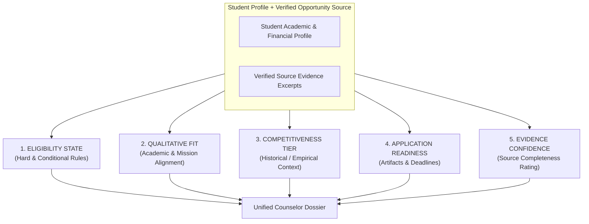
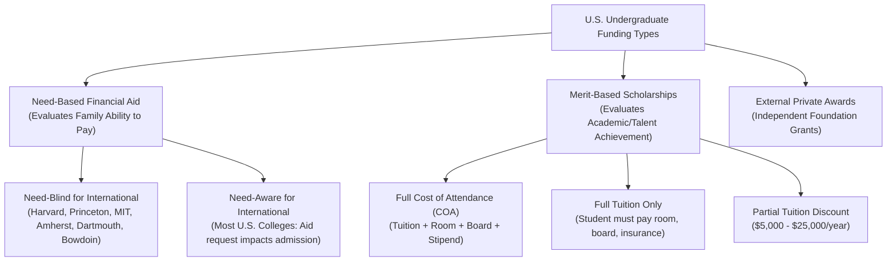

# AI Counselor & Matching Engine Architecture

**Project:** Scholarship Discovery, Verification & Counselor Platform  
**Document:** `docs/phase-0/04-counselor-ai-and-matching-architecture.md`  
**Phase:** Phase 0.2 (Final Artifact Synchronization Audit)  
**Focus:** **Qualitative Evaluation, Constraint Safety & U.S. Undergraduate Aid Semantics**  
**Governing Standard:** `Antigravity Phase 0 — Skills-Aware Addendum.md`

---

## 1. Counselor Mission & Elimination of Fake Precision

The platform's **AI Counselor** acts as an objective academic advisor for international students seeking U.S. undergraduate degrees. It explicitly rejects **fake mathematical precision**:
- The platform **never** outputs a generic "88% Fit Score" or implies an 88% probability of winning an award.
- The platform **never** fabricates acceptance rates (e.g., claiming a program has an "< 5% acceptance rate" unless that empirical data is officially published by the college).
- The counselor **never** converts missing information into an assumed pass:
  $$\text{"Information not found in authoritative source"} \centernot\implies \text{"Requirement does not exist"}$$

The counselor enforces the strict rule:
$$\text{Fit Score} \neq \text{Probability of Admission} \quad \text{and} \quad \text{Competitiveness} \neq \text{Acceptance Probability}$$

---

## 2. Decoupled Five-Dimensional Counselor Output Model

Instead of a single pseudo-scientific number, the Counselor evaluates every opportunity across five decoupled qualitative dimensions:



### Dimension A: Eligibility State
Represents whether the applicant satisfies the published criteria:
- **`ELIGIBLE`:** All published mandatory requirements are verified as met by the student's profile.
- **`LIKELY_ELIGIBLE`:** Mandatory criteria are met, but one or more conditional criteria require institutional review (e.g. departmental major acceptance).
- **`INELIGIBLE`:** Student fails at least one mandatory hard constraint (e.g., student is a U.S. permanent resident for an international-only grant, or GPA is below strict cutoff).
- **`NEEDS_MORE_INFORMATION`:** Student profile is missing a key attribute (e.g. no English proficiency score provided for a school requiring TOEFL/IELTS).
- **`CONFLICTING_INFORMATION`:** Source records contain conflicting requirements between the department and university admissions.
- **`UNVERIFIED`:** Opportunity source lacks verified eligibility text.

### Dimension B: Qualitative Fit
Measures alignment between the student's academic background/interests and the scholarship's stated focus:
- **`STRONG`:** Close alignment with the donor/institutional mission (e.g., demonstrated social impact leadership for a public service scholarship).
- **`MODERATE`:** Acceptable academic profile, but generic alignment with specific thematic priorities.
- **`WEAK`:** Minimal alignment with qualitative preferences.
- **`UNKNOWN`:** Source does not specify qualitative selection preferences.

### Dimension C: Competitiveness Level
Contextualizes the selectivity of the opportunity:
- **`VERY_HIGH`:** Institutional flagship full-ride programs (e.g., Emory University Scholars, University of Miami Stamps, Robertson Scholars) where hundreds or thousands of candidates compete for a tiny cohort.
- **`HIGH`:** Competitive selective university aid programs where aid is tied to top-quartile admission.
- **`MODERATE`:** Broad merit discounts or standard international tuition waivers awarded to all qualifying applicants meeting a published GPA/SAT benchmark.
- **`LOWER_KNOWN`:** Niche private awards with historically smaller applicant pools.
- **`UNKNOWN`:** Insufficient empirical or historical data available to assess competitiveness. (No percentage may be invented).

### Dimension D: Application Readiness
Evaluates the student's preparation relative to required deliverables:
- **`READY`:** Student possesses all required deliverables (transcripts, tests, recommendations in hand).
- **`MOSTLY_READY`:** Minor deliverables pending (e.g. final essay draft needs polish).
- **`NEEDS_PREPARATION`:** Major multi-week items missing (e.g., CSS Profile / ISFAA not drafted, recommendation letters not yet requested).
- **`NOT_READY`:** Student lacks prerequisite testing or certifications with deadline imminent ($< 14$ days).
- **`UNKNOWN`:** Application requirements not fully established.

### Dimension E: Evidence Confidence
Indicates the reliability and completeness of the source data:
- **`HIGH`:** Confirmed by current-cycle Tier 1 university portal with complete text evidence.
- **`MEDIUM`:** Official source verified, but some secondary details (e.g., exact renewal requirements) are unstated.
- **`LOW`:** Secondary source or incomplete documentation; manual verification advised.
- **`UNKNOWN`:** Source evidence incomplete or unverified.

---

## 3. Strict Constraint Taxonomy: Hard vs Conditional vs Preferred

To prevent false matches, criteria are classified into four distinct operational tiers:

| Constraint Type | Operational Definition | Matching Engine Behavior | Example |
|---|---|---|---|
| **`REQUIRED` (Hard)** | Mandatory prerequisites. Failure means absolute disqualification. | Deterministic evaluation. Failure triggers immediate `INELIGIBLE`. Missing profile data triggers `NEEDS_MORE_INFORMATION`. | Non-U.S. citizenship, high school completion, minimum unweighted GPA 3.5. |
| **`CONDITIONAL`** | Requirements that activate based on specific circumstances or admission status. | Flags condition to student. Cannot mark as passed without proof of condition. | "Must be admitted to the School of Engineering before scholarship review." |
| **`PREFERRED`** | Non-mandatory qualities that strengthen candidacy. | Influences Qualitative Fit (`STRONG`/`MODERATE`), never causes disqualification. | "Preference given to students demonstrating community service in environmental sustainability." |
| **`UNKNOWN`** | Criteria unstated or omitted in the source document. | Preserved as `UNKNOWN`. Never assumed to be missing or passed. | Source does not mention an age limit or minimum test score. |

---

## 4. Dissecting U.S. Undergraduate Funding Semantics

A critical source of student confusion is conflating **Need-Based Institutional Financial Aid** with **Full Merit Scholarships**. The system enforces explicit funding semantics:



### Canonical Funding Classification:
1. **`FULL_COST_OF_ATTENDANCE` (Full Ride):** Covers 100% of Tuition, Mandatory Fees, Room, Board, Books, and Health Insurance.
2. **`FULL_TUITION`:** Covers 100% of tuition only. The student remains responsible for housing, meals, books, and insurance ($15,000–$22,000/year).
3. **`PARTIAL_TUITION`:** Fixed dollar amount (e.g. $10,000/year) or percentage discount.
4. **`STIPEND_ONLY`:** Living allowance without tuition waiver.
5. **`ROOM_AND_BOARD`:** Housing and meal coverage only.
6. **`TRAVEL_SUPPORT`:** One-time or annual airfare allowance.
7. **`100% DEMONSTRATED NEED MET` (Special Category):**
   - **Crucial Counselor Rule:** *100% demonstrated financial need does NOT mean a free scholarship.*
   - The institution determines the Expected Family Contribution (EFC) based on submitted ISFAA / CSS Profile financial forms. The college covers the remaining gap between the cost of attendance and the calculated family contribution.
   - The counselor must explicitly state: *"This institution covers 100% of demonstrated need. Your award will depend on your family's verified income and assets, and may include a campus work-study component."*

---

## 5. Matching Engine Safety Sequence

The matching engine processes opportunities in a strict, audited 10-step sequence:

```text
1. Validate student profile completeness across required fields.
2. Filter active cycle opportunities (academic_year == current_cycle).
3. Evaluate deterministic HARD constraints (Citizenship, Degree == Bachelor's, Destination == USA, Deadlines).
4. For any failed hard constraint, set state to INELIGIBLE and attach exact disqualifying citation.
5. Evaluate CONDITIONAL constraints; if unsatisfied, set state to LIKELY_ELIGIBLE or NEEDS_MORE_INFORMATION.
6. If any critical profile field is missing, preserve UNKNOWN rather than excluding or passing.
7. Compute qualitative FIT (STRONG, MODERATE, WEAK, UNKNOWN) based on verified PREFERRED attributes.
8. Assess qualitative COMPETITIVENESS tier from verified institutional selectivity context.
9. Generate structured Counselor Dossier with source-anchored citations for every major claim.
10. Attach Evidence Confidence rating (HIGH, MEDIUM, LOW, UNKNOWN).
```

---

## 6. U.S. Undergraduate Comparison Matrix (Qualitative Format)

The Comparison Engine normalizes opportunities strictly using verifiable evidence without fabricated percentages:

| Evaluation Dimension | Dartmouth International Need-Based Aid | Clark University Global Scholars | University of Miami Stamps Scholars |
|---|---|---|---|
| **Aid Category** | Institutional Need-Based Aid | Institutional Merit/Need Hybrid | Institutional Flagship Merit |
| **International Admissions Policy** | Need-Blind for All International | Need-Aware for International | Merit Review (Admission Evaluated Separately) |
| **Funding Scope** | 100% Demonstrated Financial Need | Partial Tuition ($15k–$25k/yr) + $2.5k Stipend | Full Cost of Attendance (Tuition + Room/Board + Tech Allowance) |
| **Primary Deadlines** | ED: Nov 1 / RD: Jan 2 / Aid: Feb 1 | EA: Nov 15 / RD: Jan 15 | EA: Nov 1 (Priority Scholarship Deadline) |
| **Financial Forms Required** | CSS Profile + Tax Returns / W-2 equivalents | CSS Profile or ISFAA form | None required for merit review |
| **Competitiveness Tier** | `VERY_HIGH` (Ivy League Selectivity) | `HIGH` (Selective Merit Cohort) | `VERY_HIGH` (Top < 1% of applicant pool) |
| **Readiness Check** | CSS Profile, Tax Translations, 2 Recs | Common App, 2 Recs, High School Transcript | Early Action Common App, Nomination if applicable |

---

## 7. Sample U.S. Undergraduate Counselor Dossier

```json
{
  "opportunity_id": "clark-global-scholars-2026",
  "opportunity_title": "Global Scholars Program",
  "institution_name": "Clark University",
  "degree_level": "UNDERGRADUATE_BACHELOR",
  "evaluation_dimensions": {
    "eligibility_state": "ELIGIBLE",
    "qualitative_fit": "STRONG",
    "competitiveness_level": "HIGH",
    "readiness_state": "NEEDS_PREPARATION",
    "evidence_confidence": "HIGH"
  },
  "hard_constraints_audit": [
    {
      "criterion": "Citizenship",
      "requirement": "Non-U.S. Citizen / Non-Permanent Resident",
      "student_value": "Ghanaian Citizen (International F-1)",
      "result": "PASSED",
      "source_citation": "Open to first-year international applicants who are not U.S. citizens or permanent residents."
    },
    {
      "criterion": "Degree Level",
      "requirement": "First-year undergraduate (Bachelor's)",
      "student_value": "High School Senior applying for Bachelor's",
      "result": "PASSED",
      "source_citation": "Candidates must be entering their first year of undergraduate study."
    }
  ],
  "funding_breakdown_analysis": {
    "funding_type": "PARTIAL_TUITION_PLUS_STIPEND",
    "financial_reality": "Covers $15,000 to $25,000 per year toward tuition plus a $2,500 summer internship stipend. Does NOT cover room and board (~$11,000/yr) or health insurance (~$2,500/yr). Student must demonstrate ability to finance remaining balance.",
    "source_citation": "Scholarship ranges from $15,000 to $25,000 annually, contingent upon meeting academic requirements for renewal."
  },
  "competitiveness_context": {
    "tier": "HIGH",
    "notes": "Highly selective merit scholarship evaluated during undergraduate admissions. Clark states finalists typically rank in the top 5% of their secondary school class.",
    "empirical_acceptance_rate": null,
    "empirical_evidence_citation": "No official historical acceptance percentage published by Clark University for this specific cohort."
  },
  "actionable_readiness_checklist": [
    {
      "item": "Submit Common Application with Clark Member Section",
      "deadline_type": "EARLY_ACTION",
      "due_date": "2026-11-15",
      "status": "NOT_STARTED"
    },
    {
      "item": "Submit CSS Profile or International Student Financial Aid Application (ISFAA)",
      "deadline_type": "FINANCIAL_AID_PRIORITY",
      "due_date": "2026-11-15",
      "status": "IN_PROGRESS"
    }
  ]
}
```
