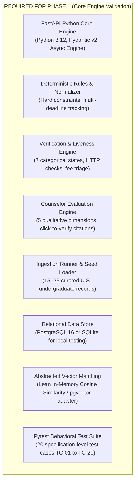
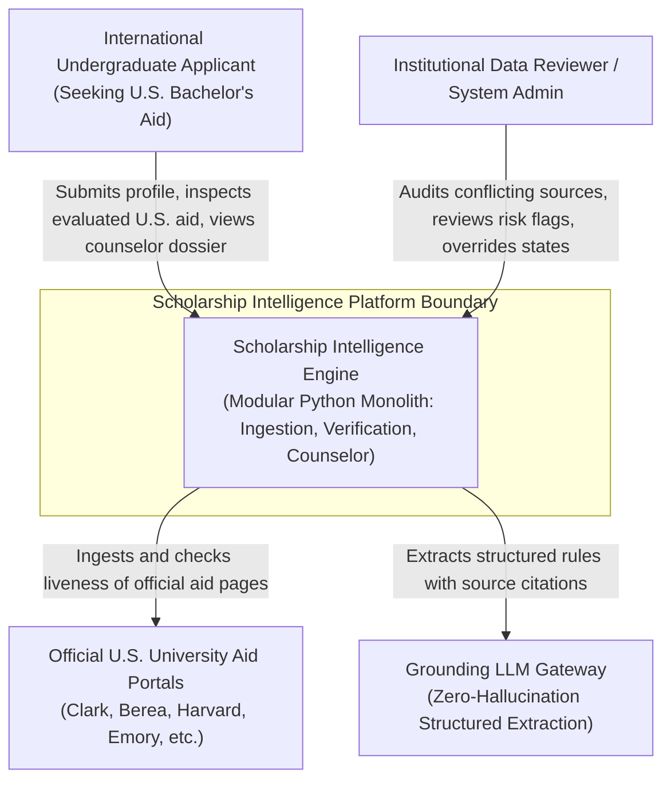
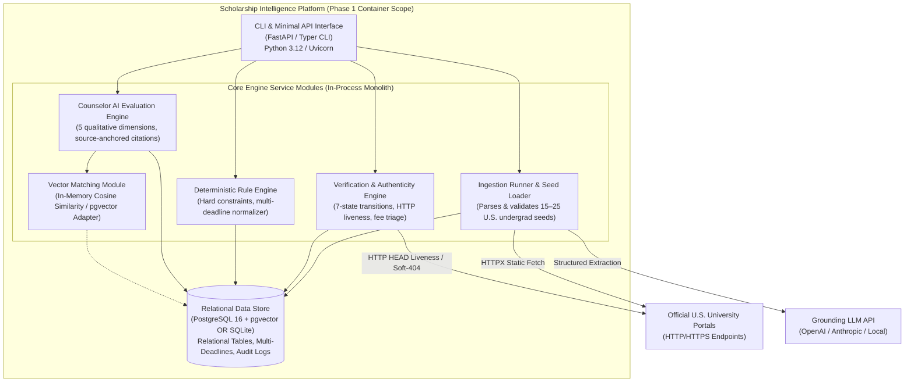

# Technical Architecture & C4 System Specification

**Project:** Scholarship Discovery, Verification & Counselor Platform  
**Document:** `docs/phase-0/05-technical-architecture-and-c4-spec.md`  
**Phase:** Phase 0.2 (Final Documentation Correction & Consistency Audit)  
**Architecture Optimization:** **Solo Developer · Lean Operational Cost · Modular Foundations**  
**Governing Standard:** `Antigravity Phase 0 — Skills-Aware Addendum.md`

---

## REQUIRED FOR PHASE 1

Phase 1 focuses strictly on core engine validation, deterministic rule execution, verification state modeling, and counselor reasoning over a curated 15–25 record U.S. undergraduate financial aid seed dataset. The required components are:

### Component Justifications

1. **Python Core Engine (FastAPI + Pydantic v2):**
   - *Why Needed:* Provides high-performance async REST interfaces, automatic OpenAPI specification generation, and strict Pydantic v2 input/output schema normalization.
   - *Phase 1 Role:* Exposes headless evaluation endpoints (`/api/v1/evaluate`, `/api/v1/verify`, `/api/v1/scholarships`) for testing without a frontend.
   - *Operational Cost:* $0 (Runs locally / low-spec Linux VM).

2. **Deterministic Rules & Normalizer:**
   - *Why Needed:* Enforces binary hard constraints (citizenship, degree level = Bachelor's, minimum GPA, active cycle year) and normalizes multi-deadline structures.
   - *Phase 1 Role:* Eliminates unqualified opportunities prior to qualitative counseling evaluation.
   - *Operational Cost:* $0.

3. **Verification & Authenticity Engine:**
   - *Why Needed:* Executes deterministic verification state transitions across the 7 formal states (`VERIFIED`, `PARTIALLY_VERIFIED`, `CONFLICTING`, `OUTDATED`, `UNVERIFIED`, `SOURCE_UNAVAILABLE`, `QUARANTINED`).
   - *Phase 1 Role:* Conducts HTTP liveness/soft-404 sweeps and contextual fee/PII triage (`SIGNAL → RISK FLAG → EVIDENCE REVIEW → STATUS`).
   - *Operational Cost:* $0.

4. **Counselor Evaluation Engine:**
   - *Why Needed:* Synthesizes qualitative evaluation across 5 decoupled dimensions: Eligibility, Fit, Competitiveness, Readiness, and Evidence Confidence (`HIGH`, `MEDIUM`, `LOW`, `UNKNOWN`).
   - *Phase 1 Role:* Generates structured counselor dossiers with source-anchored citations; enforces the invariant: *information not found in an authoritative source does NOT mean the requirement does not exist*.
   - *Operational Cost:* $0 (Deterministic templates) / minimal token cost for grounded LLM validation.

5. **Ingestion Runner & Seed Loader:**
   - *Why Needed:* Deterministically populates the system with the 15–25 verified U.S. undergraduate financial aid programs (e.g., Clark Global Scholars, Berea, Emory, Harvard, Dartmouth).
   - *Phase 1 Role:* Validates schema conformity, multi-deadline parsing, and evidence snippet anchoring on startup or test execution.
   - *Operational Cost:* $0.

6. **Relational Data Store (PostgreSQL 16 or SQLite):**
   - *Why Needed:* Relational persistence for institutions, scholarships, multi-deadline entries, eligibility rules, verification logs, and student profiles.
   - *Phase 1 Role:* Supports ACID transactions, complex relational filters (citizenship + GPA + deadline), and foreign key integrity. SQLite provides zero-setup local/CI execution; PostgreSQL is used for production parity.
   - *Operational Cost:* $0 local.

7. **Vector Matching Strategy & Justification (pgvector vs In-Memory Cosine Similarity):**
   - *Seed Dataset Scale:* For the Phase 1 seed dataset of 15–25 records, in-memory cosine similarity in Python (using `numpy`, `scipy`, or pure Python math) is computationally trivial (execution latency $< 1\text{ms}$), adds zero external database extension dependencies, and runs seamlessly in isolated CI/CD environments.
   - *pgvector Trade-off:* `pgvector` adds an external PostgreSQL extension dependency, requiring specific container images or database support. Its operational benefit is SQL-native hybrid querying (executing relational SQL `WHERE` clauses and vector `<->` distance ordering within a single database execution plan).
   - *Phase 1 Architectural Decision:* The platform implements an abstracted `VectorStoreInterface`:
     - **Default Dev/Test Engine:** In-memory cosine similarity over the 15–25 embedded seed records. This allows zero-dependency SQLite local test runs and rapid development.
     - **Database-Level Adapter:** A `pgvector` adapter is retained as an optional database-level implementation for PostgreSQL, justified when validating unified SQL hybrid query plans during Phase 1F benchmarks.

8. **Pytest Behavioral Test Suite:**
   - *Why Needed:* Guarantees correctness against the 20 formal specification test cases (TC-01 through TC-20).
   - *Phase 1 Role:* Continuous verification gate before Phase 2 frontend development.
   - *Operational Cost:* $0.

---

## OPTIONAL IF JUSTIFIED

Components that are designed into the architecture but only enabled if specific operational needs arise during Phase 1:

1. **In-Process Background Task Worker (FastAPI `BackgroundTasks` / `asyncio.create_task`):**
   - *Classification:* `OPTIONAL IF JUSTIFIED`
   - *Why Justified:* If periodic HTTP liveness sweeps over the 15–25 seed URLs cause measurable latency spikes during interactive API testing, non-blocking in-process async tasks will execute sweeps in the background.
   - *Why Not Distributed:* A separate worker daemon (Celery) is completely unjustified for 15–25 URLs; single-process async I/O handles 50+ concurrent requests effortlessly at zero infrastructure cost.
   - *Operational Cost:* $0.

---

## DEFERRED

Components explicitly excluded from Phase 1 and deferred to later phases:

1. **Next.js App Router Web Frontend (Deferred to Phase 2):**
   - *Why Deferred:* Core matching logic, verification states, and data schemas must be frozen and validated via automated behavioral tests and OpenAPI interfaces before investing engineering effort into UI components.
   - *Migration Path:* In Phase 2, a Next.js 14/15 App Router frontend (Tailwind CSS, TypeScript) will be built against the frozen Phase 1 REST API contracts.

2. **Redis + Celery Task Queue (Deferred to Phase 4):**
   - *Why Deferred:* The Phase 1 workload consists of 15–25 seed records. A distributed message broker (Redis) and distributed task consumer (Celery) introduce unnecessary operational overhead (broker maintenance, worker heartbeats, state management, serialization).
   - *Migration Path:* Introduced in Phase 4 when ingestion scales to hundreds of scheduled scrapers requiring distributed job queuing and rate limiting.

3. **Playwright Headless Browser Farm (Deferred to Phase 4):**
   - *Why Deferred:* Headless browser automation consumes significant CPU/RAM and introduces complex sandbox dependencies. 90%+ of university aid pages are static HTML cleanly parseable via HTTPX and BeautifulSoup.
   - *Migration Path:* Added in Phase 4 as an isolated worker service for dynamic JavaScript-rendered portals where static extraction is insufficient. Phase 1 relies on HTTPX and curated manual fallback.

4. **Distributed Caching & Content Delivery Network (Deferred to Phase 4/5):**
   - *Why Deferred:* With a 15–25 record seed dataset, in-memory caching or direct relational queries respond in $< 10\text{ms}$. CDN edge caching is unnecessary before public multi-user launch.

---

## FUTURE SCALE

Long-term architecture patterns reserved for post-launch enterprise scale:

1. **Multi-Region Database Replication & High Availability (Phase 5+):**
   - Active-passive or multi-region database replication for global low-latency reads.
2. **Microservices Decomposition (Phase 5+):**
   - Separating the Ingestion Pipeline, Verification Service, and Counselor Engine into autonomous microservices if organizational team boundaries dictate it.
3. **Kafka / RabbitMQ Event Streaming (Phase 5+):**
   - Replacing internal async event dispatchers with distributed event streams for enterprise audit compliance.

---

## 2. C4 Context Model: System Boundary (U.S. Undergraduate Focus)

---

## 3. C4 Container Model: Phase 1 Lean Monolith

The Phase 1 container model contains **ONLY** components implemented and running in Phase 1. No frontend, no distributed brokers, and no headless browser farms:

---

## 4. Measurable Engineering Performance Targets (Benchmarking Plan)

All performance assertions are framed as empirical targets to be benchmarked during Phase 1 on the verified 15–25 record U.S. undergraduate financial aid seed dataset. No unmeasured guarantees (such as "$< 50\text{ms}$ across millions of records") are asserted:

| Metric | Target Specification | Benchmark Query / Payload | Percentile Target | Validation Phase |
|---|---|---|:---:|:---:|
| **Faceted SQL Filter Latency** | To be benchmarked during Phase 1 on 15–25 seed dataset; target: $p95 \le 100\text{ms}$ | Relational filter: Citizenship + Major + GPA + Deadline on seed records | $p95$ | Phase 1F |
| **Vector Similarity Match Latency** | To be benchmarked during Phase 1 on 15–25 seed dataset; target: $p95 \le 250\text{ms}$ | Cosine similarity match across embedded scholarship descriptions (In-memory or pgvector) | $p95$ | Phase 1F |
| **Deterministic Rule Audit** | To be benchmarked during Phase 1 on 15–25 seed dataset; target: $p99 \le 30\text{ms}$ | 10-step constraint validation for a single student profile against 25 opportunities | $p99$ | Phase 1F |
| **Verification Sweep Latency** | To be benchmarked during Phase 1 on 15–25 seed dataset; target: $\ge 5\text{ checks/sec}$ | Concurrent HTTP `HEAD` / Soft-404 checks with polite 3s domain throttling | Average | Phase 1F |

---

## 5. Domain Data Model & Entity-Relationship Specification

The data model supports complex real-world rules (composite disjunctions like "3.5 GPA OR top 10% of class"), multi-deadline tracking, conflicting sources, and source-anchored citations:

```mermaid
erDiagram
    STUDENT_PROFILES ||--o{ COUNSELOR_DOSSIERS : generates
    STUDENT_PROFILES ||--o{ SAVED_OPPORTUNITIES : tracks
    
    INSTITUTIONS ||--o{ SCHOLARSHIPS : offers
    SCHOLARSHIPS ||--o{ SCHOLARSHIP_DEADLINES : has
    SCHOLARSHIPS ||--o{ ELIGIBILITY_RULES : requires
    SCHOLARSHIPS ||--o{ SCHOLARSHIP_SOURCES : corroborated_by
    SCHOLARSHIPS ||--o{ VERIFICATION_AUDIT_LOGS : records
    SCHOLARSHIPS ||--o{ CONFLICTING_SOURCES_LOGS : logs
    SCHOLARSHIPS ||--o{ SAVED_OPPORTUNITIES : bookmarked_in

    INSTITUTIONS {
        uuid id PK
        string name
        string city
        string state
        string country
        string admissions_need_policy "NEED_BLIND_INTERNATIONAL, NEED_AWARE_INTERNATIONAL"
        string official_admissions_url
        string official_financial_aid_url
    }

    SCHOLARSHIPS {
        uuid id PK
        uuid institution_id FK
        string external_id
        string fingerprint_sha256 UK
        string title
        string aid_category "INSTITUTIONAL_NEED, INSTITUTIONAL_MERIT, EXTERNAL_FOUNDATION"
        string funding_type "FULL_COST_OF_ATTENDANCE, FULL_TUITION, PARTIAL_TUITION, STIPEND_ONLY, DEMONSTRATED_NEED"
        float award_amount_min
        float award_amount_max
        string currency
        boolean renewable
        text renewal_conditions
        string verification_status "VERIFIED, PARTIALLY_VERIFIED, CONFLICTING, OUTDATED, UNVERIFIED, SOURCE_UNAVAILABLE, QUARANTINED"
        string active_cycle_year "e.g. 2026-2027"
        vector embedding_768
        timestamp last_verified_at
        timestamp created_at
    }

    SCHOLARSHIP_DEADLINES {
        uuid id PK
        uuid scholarship_id FK
        string deadline_type "EARLY_DECISION, EARLY_ACTION, REGULAR_DECISION, SCHOLARSHIP_PRIORITY, FINANCIAL_AID_PRIORITY, ROLLING, VARIES_BY_PROGRAM"
        date deadline_date
        string timezone
        text context_description
        text source_evidence_snippet
    }

    ELIGIBILITY_RULES {
        uuid id PK
        uuid scholarship_id FK
        string rule_type "REQUIRED, CONDITIONAL, PREFERRED"
        string field_name "citizenship, gpa, standardized_test, major, financial_need"
        string operator "EQUALS, NOT_EQUALS, GTE, LTE, IN_LIST, COMPOSITE_OR"
        string target_value
        string composite_condition_json
        text source_evidence_snippet
        boolean is_verified
    }

    SCHOLARSHIP_SOURCES {
        uuid id PK
        uuid scholarship_id FK
        string source_tier "TIER_1_OFFICIAL, TIER_2_PARTNER, TIER_3_REPUTABLE_SECONDARY, TIER_4_AGGREGATOR"
        string url
        string source_domain
        boolean is_primary
        timestamp last_crawled_at
        integer last_http_status
    }

    CONFLICTING_SOURCES_LOGS {
        uuid id PK
        uuid scholarship_id FK
        string field_name
        text primary_source_value
        text conflicting_source_value
        string conflicting_source_url
        string resolution_status "OPEN, RESOLVED_OFFICIAL_PREFERRED, DISMISSED"
        timestamp recorded_at
    }

    VERIFICATION_AUDIT_LOGS {
        uuid id PK
        uuid scholarship_id FK
        string check_type "HTTP_LIVENESS, SOFT_404, CYCLE_FRESHNESS, SCAM_TRIAGE"
        string previous_state
        string new_state
        text audit_notes
        timestamp executed_at
    }

    STUDENT_PROFILES {
        uuid id PK
        string citizenship_country "REQUIRED"
        string residence_country "REQUIRED"
        string target_degree_level "REQUIRED - BACHELOR"
        string target_destination_country "REQUIRED - US"
        float gpa_unweighted "RECOMMENDED"
        float gpa_scale "RECOMMENDED"
        string primary_major_interest "OPTIONAL"
        string standardized_test_type "OPTIONAL - SAT, ACT, NONE"
        integer standardized_test_score "OPTIONAL"
        string english_test_type "OPTIONAL - TOEFL, IELTS, DUOLINGO"
        float english_test_score "OPTIONAL"
        string financial_need_tier "SENSITIVE - HIGH, MODERATE, LOW, NONE"
        text personal_background_summary "OPTIONAL"
        vector profile_embedding "DERIVED"
        timestamp updated_at
    }
```

---

## 6. Student Profile Data Classification

In strict alignment with privacy-by-design principles, profile fields are categorized into five tiers:

- **`REQUIRED`:** Minimum fields necessary to evaluate basic geographic and degree eligibility:
  - `citizenship_country` (ISO-3166 alpha-2)
  - `residence_country` (ISO-3166 alpha-2)
  - `target_degree_level` (Strictly `BACHELOR` in MVP)
  - `target_destination_country` (Strictly `US` in MVP)
- **`RECOMMENDED`:** Academic metrics required to evaluate merit thresholds:
  - `gpa_unweighted` (Normalized float)
  - `gpa_scale` (e.g., 4.0, 5.0, 100%)
- **`OPTIONAL`:** Criteria for nuanced matching and qualitative fit:
  - `primary_major_interest` (CIP code or text string)
  - `standardized_test_type` / `standardized_test_score` (SAT, ACT, or None)
  - `english_test_type` / `english_test_score` (TOEFL, IELTS, Duolingo)
  - `personal_background_summary` (Free-form text for holistic alignment)
- **`SENSITIVE`:** Self-reported financial need tier:
  - `financial_need_tier` (`HIGH`, `MODERATE`, `LOW`, `NONE`).
  - *Data Boundary:* Self-reported only; strictly excludes bank account numbers, tax documents, and social security numbers. Stored with field-level encryption attributes and excluded from public payloads.
- **`DERIVED`:** System-generated vector representations:
  - `profile_embedding`: Numerical vector generated exclusively from academic interests and goals, containing zero personally identifiable information (PII).
