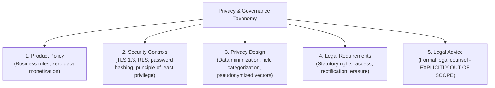

# Risk Analysis & Mitigation Framework

**Project:** Scholarship Discovery, Verification & Counselor Platform  
**Document:** `docs/phase-0/06-risk-analysis-and-mitigation.md`  
**Phase:** Phase 0.1 (Targeted Scope Correction & Pre-Phase-1 Audit)  
**Focus:** **Privacy-by-Design, Risk Triage & Compliance Distinctions**  
**Governing Standard:** `Antigravity Phase 0 — Skills-Aware Addendum.md`

---

## 1. Compliance Disclaimer & Taxonomy of Privacy Controls

> [!IMPORTANT]
> **Legal Disclaimer:** The technical specifications and privacy controls outlined in this document represent **engineering and architectural measures intended to reduce privacy and regulatory risk**. They do NOT constitute formal legal counsel, nor do they guarantee absolute legal compliance under the General Data Protection Regulation (GDPR), Family Educational Rights and Privacy Act (FERPA), or other jurisdictional statutes. Formal legal compliance requires institutional legal review.

To ensure clarity and precision, privacy and security mechanisms are classified across five distinct categories:

1. **Product Policy:** Platform operating covenants (e.g., zero sale of student personal data to third-party commercial brokers or lenders).
2. **Security Controls:** Cryptographic and technical enforcement measures (TLS 1.3, encrypted database fields at rest, Row-Level Security).
3. **Privacy Design:** Intentional architectural patterns (data minimization, absence of banking credential fields, localized readiness tracking).
4. **Legal Requirements:** Jurisdictional standards (e.g., handling data subject requests for erasure under GDPR Art. 17).
5. **Legal Advice:** Professional legal counsel (the engineering team does not provide legal opinions).

---

## 2. Risk Assessment Matrix (U.S. Undergraduate Focus)

| Risk ID | Risk Vector | Severity | Likelihood | Risk Score | Primary Engineering Mitigation Strategy |
|---|---|---|---|---|---|
| **RSK-01** | Scraper IP blocking & anti-bot restrictions | High | High | **Critical** | Strict `robots.txt` compliance, no bypass scripts; manual curated fallback |
| **RSK-02** | Stale data & missed early application deadlines | High | High | **Critical** | Automated 72-hr liveness checks & multi-deadline tracking (Early Action/Decision) |
| **RSK-03** | LLM hallucination of international eligibility | Critical | Medium | **Critical** | Source-anchored verbatim extraction constraint & `UNKNOWN` state preservation |
| **RSK-04** | Student PII leakage & data exposure | Critical | Low | **High** | Data minimization, sensitive field isolation, zero financial credential collection |
| **RSK-05** | Infiltration of pay-to-apply predatory scams | Critical | Low | **High** | Multi-tier fee/PII risk triage (`SIGNAL → RISK FLAG → EVIDENCE REVIEW`) |
| **RSK-06** | Cloud/LLM token cost overruns | Medium | High | **High** | Relational constraint pre-filtering (eliminating 90%+ before vector/LLM calls) |

---

## 3. In-Depth Risk Profiles & Operational Mitigations

### RSK-01: Scraper IP Blocking & Anti-Bot Boundaries
- **Failure Mode:** University admissions sites or financial aid directories return HTTP 403 Forbidden, rate-limit headers, or Cloudflare verification pages.
- **Root Cause:** Ingestion scripts attempting automated requests on domains with strict anti-bot policies.
- **Engineering Mitigations & Ethical Crawling Covenant:**
  1. *No Bypass Mechanisms:* The system will **never** implement CAPTCHA-breaking tools, unauthorized proxy rotation, or bot-masking exploits.
  2. *Strict Politeness:* 3–5 second randomized delays between domain requests; honors `robots.txt` disallow rules.
  3. *Curated Verification Fallback:* If an official university portal restricts automated crawling, the opportunity is routed to a **manual / semi-automated staff curation queue**. A human researcher accesses the public site via a standard browser, verifies the terms, and inputs the source-anchored citations.

### RSK-02: Stale Data & Missed Early Deadlines
- **Failure Mode:** An international applicant misses the Early Action (Nov 15) priority scholarship deadline because the platform only displayed the Regular Decision date (Jan 15).
- **Root Cause:** Collapsing multiple distinct institutional deadlines into a single generic date field.
- **Engineering Mitigations:**
  1. *Multi-Deadline Schema:* Explicitly stores distinct dates (`EARLY_ACTION`, `REGULAR_DECISION`, `FINANCIAL_AID_PRIORITY`).
  2. *Urgency Highlighting:* The comparison UI explicitly displays the earliest binding cutoff required for scholarship consideration.
  3. *Automated 72-Hour Liveness Checks:* Periodic HTTP `HEAD` sweeps flag dead links (`SOURCE_UNAVAILABLE`) or discontinued programs (`OUTDATED`).

### RSK-03: LLM Hallucination of Eligibility
- **Failure Mode:** An LLM informs an international student they are eligible for an endowed award when the fine print restricts it to graduates of specific domestic U.S. high schools.
- **Root Cause:** Unconstrained generative inference filling in missing facts.
- **Engineering Mitigations:**
  1. *Literal Grounding Rule:* Prompts operate at `temperature = 0.0` with strict schema validation.
  2. *Preservation of `UNKNOWN`:* If the source text does not explicitly state citizenship or testing criteria, the field must remain `UNKNOWN`. The system is forbidden from assuming a requirement is satisfied.
  3. *Click-to-Verify Citations:* Every eligibility criterion links directly to an official source excerpt in the student UI.

### RSK-04: Student PII Minimization & Regulatory Risk Reduction
- **Failure Mode:** Storing sensitive student identity or financial records makes the platform a target for data theft.
- **Root Cause:** Over-collecting personal data during student profile onboarding.
- **Engineering Mitigations (Privacy-by-Design):**
  1. *Strict Data Minimization:* The MVP **never** collects Social Security Numbers (SSN), national identity card scans, bank routing numbers, online banking passwords, or full tax returns.
  2. *Profile Field Tiering:*
     - `REQUIRED`: High-level criteria only (citizenship, current country of residence, degree level = Bachelor's, target = US).
     - `RECOMMENDED`: Academic metrics (self-reported unweighted GPA).
     - `OPTIONAL`: Test scores (SAT/ACT/TOEFL) and general interest statements.
     - `SENSITIVE`: Broad financial need tier (High, Moderate, Low, None) self-reported without bank documentation.
     - `DERIVED`: Numerical vector embeddings without embedded student identity tokens.
  3. *Account Deletion & Data Portability:* Built-in API endpoints for self-service complete account erasure (`DELETE /api/v1/profile`) and data export (`GET /api/v1/profile/export`).

### RSK-05: Infiltration of Predatory Scams
- **Failure Mode:** A commercial lead aggregator or fraudulent scholarship tricks students into paying a submission fee.
- **Root Cause:** Relying on simplistic binary keywords without contextual triage.
- **Engineering Mitigations:**
  1. *Multi-Tiered Risk Triage:* Replaces blunt auto-kill rules with contextual analysis:
     $$\text{SIGNAL} \longrightarrow \text{RISK FLAG} \longrightarrow \text{EVIDENCE REVIEW} \longrightarrow \text{STATUS}$$
  2. *Fee Contextualization:* Distinguishes legitimate Common App college admissions fees ($50–$90) and testing fees from suspicious scholarship entry fees.
  3. *Zero-Tolerance Disbursement Scams:* Any listing demanding money in exchange for "guaranteed award payment" is immediately `QUARANTINED`.
  4. *No Automated Perfection Claim:* Transparent disclaimer that automated heuristics assist, but do not replace, human institutional review and student diligence.

### RSK-06: LLM Token Cost Overruns
- **Failure Mode:** Running deep LLM reasoning over hundreds of scholarship pages for every student search generates unsustainable cloud API bills.
- **Root Cause:** Lack of database pre-filtering before LLM inference.
- **Engineering Mitigations:**
  1. *Two-Stage Pipeline:* Deterministic SQL filters eliminate $\ge 90\%$ of opportunities based on hard relational constraints (citizenship, degree level, GPA, active cycle) before passing candidate records to vector or LLM evaluation.
  2. *Static Extraction at Ingestion:* Schema normalization and vector embeddings are generated once during ingestion/verification, never recomputed dynamically on search queries.
  3. *Dossier Caching:* Counselor analysis responses are cached in local memory/cache keyed by `(student_profile_hash, scholarship_fingerprint)`.
