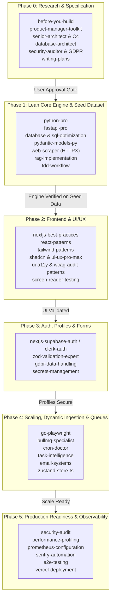

# Skills Inventory & Phase Allocation Report

**Project:** Scholarship Discovery, Verification & Counselor Platform  
**Document:** `docs/phase-0/skills-inventory.md`  
**Phase:** Phase 0.2 (Final Artifact Synchronization Audit)  
**Environment Status:** Verified against installed skills in `~/.agents/skills`  
**Governing Standard:** `Antigravity Phase 0 — Skills-Aware Addendum.md`

---

## 1. Discovered Skills Inventory

The following table catalogs verified skills discovered in the local environment (`/home/hezekiah/.agents/skills/`), mapped to their applicable project lifecycle phases. All listed skills have been checked for physical existence (`SKILL.md` present) and evaluated for appropriateness.

| Skill | Available | Relevant Phase | Purpose | Used Now |
|---|---|---|---|---|
| `before-you-build` | Yes | Phase 0 | Review product risk, demand assumptions, switching costs, and failure signals before coding | **Yes** |
| `product-manager-toolkit` | Yes | Phase 0 | Formalize problem statements, persona requirements, and MVP boundary definitions | **Yes** |
| `spec-driven-development` | Yes | Phase 0 | Define verifiable, specification-first requirements preventing premature implementation | **Yes** |
| `deep-research` | Yes | Phase 0 | Conduct deep investigation into scholarship data landscape and portal mechanics | **Yes** |
| `search-specialist` | Yes | Phase 0 | Targeted research of authentic scholarship providers, public datasets, and APIs | **Yes** |
| `senior-architect` | Yes | Phase 0 / 1 | High-level system architecture trade-offs, scalability, and stack evaluation | **Yes** |
| `c4-context` | Yes | Phase 0 | Model system context boundary, external actors (students, providers, admins) | **Yes** |
| `c4-container` | Yes | Phase 0 | Document container-level architecture, interfaces, and inter-service protocols | **Yes** |
| `database-architect` | Yes | Phase 0 / 1 | Model domain entities, schema design, vector indexing, and relational integrity | **Yes** |
| `security-auditor` | Yes | Phase 0 / 5 | Threat modeling (STRIDE), data flow analysis, PII protection, scam prevention | **Yes** |
| `gdpr-data-handling` | Yes | Phase 0 / 3 | Privacy-by-design controls to reduce privacy and regulatory risk under GDPR | **Yes** |
| `privacy-by-design` | Yes | Phase 0 / 3 | Data minimization and student privacy boundary architecture | **Yes** |
| `writing-plans` | Yes | Phase 0 | Draft disciplined, step-by-step phased implementation roadmap | **Yes** |
| `competitor-analysis` | Yes | Phase 0 | Analyze existing scholarship portals (Fastweb, Scholarships.com) to identify gaps | **Yes** |
| `python-pro` | Yes | Phase 1 | Python backend engineering best practices, typing, and async architecture | No |
| `fastapi-pro` | Yes | Phase 1 | High-performance asynchronous REST API design and contract enforcement | No |
| `database` | Yes | Phase 1 | Database connection lifecycle, migrations, and transactional execution | No |
| `sql-optimization-patterns` | Yes | Phase 1 | Index optimization, query execution plan analysis, and query tuning | No |
| `pydantic-models-py` | Yes | Phase 1 | Multi-model validation schemas, runtime validation, and API typing | No |
| `web-scraper` | Yes | Phase 1 | Polite HTTP static extraction for primary university aid pages | No |
| `rag-implementation` | Yes | Phase 1 | Retrieval-Augmented Generation pipeline for AI Counselor query grounding | No |
| `similarity-search-patterns`| Yes | Phase 1 | Vector similarity algorithms for matching student profiles to opportunities | No |
| `api-patterns` | Yes | Phase 1 | RESTful conventions, error formats, pagination, and API versioning | No |
| `tdd-workflow` | Yes | Phase 1 | Strict Red-Green-Refactor test cycle for matching algorithms and scrapers | No |
| `test-driven-development` | Yes | Phase 1 | Test harness construction, mocking, and behavioral test specifications | No |
| `nextjs-best-practices` | Yes | Phase 2 | Next.js App Router, React Server Components (RSC), SSR/SSG patterns | No |
| `react-patterns` | Yes | Phase 2 | Modular component hierarchy, custom hooks, and state isolation | No |
| `tailwind-patterns` | Yes | Phase 2 | CSS token design, fluid typography, responsive layout styling | No |
| `shadcn` | Yes | Phase 2 | Primitive-based accessible component library implementation | No |
| `ui-ux-pro-max` | Yes | Phase 2 | Information architecture, user flows, comparison matrices, and UI ergonomics | No |
| `frontend-design` | Yes | Phase 2 | Production layout aesthetics, student-centric micro-interactions | No |
| `ui-a11y` | Yes | Phase 2 | Accessibility auditing and compliance verification | No |
| `wcag-audit-patterns` | Yes | Phase 2 | WCAG 2.2 Level AA guidelines validation | No |
| `screen-reader-testing` | Yes | Phase 2 | Assistive technology compatibility testing for student accessibility | No |
| `react-component-performance`| Yes | Phase 2 | React profiling, memoization, and bundle size minimization | No |
| `nextjs-supabase-auth` | Yes | Phase 3 | Supabase Authentication integration, session cookies, and RLS | No |
| `clerk-auth` | Yes | Phase 3 | Alternative authentication provider evaluation | No |
| `zod-validation-expert` | Yes | Phase 3 | Client/server form validation for student profile and filter inputs | No |
| `secrets-management` | Yes | Phase 3 | Secure environment variable handling and secret rotation | No |
| `go-playwright` | Yes | Phase 4 | Headless browser execution for dynamic JavaScript single-page applications | No |
| `bullmq-specialist` | Yes | Phase 4 | Distributed background task queue management for scraping and verification | No |
| `cron-doctor` | Yes | Phase 4 | Reliable scheduled job configuration for deadline tracking and crawlers | No |
| `task-intelligence` | Yes | Phase 4 | Workflow orchestration and job status tracking | No |
| `upstash-qstash` | Yes | Phase 4 | Serverless message queuing and webhook scheduling | No |
| `email-systems` | Yes | Phase 4 | Transactional email delivery for upcoming deadline alerts | No |
| `zustand-store-ts` | Yes | Phase 4 | Client-side reactive state for active scholarship comparison lists | No |
| `security-audit` | Yes | Phase 5 | Pre-launch comprehensive vulnerability audit and penetration review | No |
| `performance-profiling` | Yes | Phase 5 | Latency benchmarking, database throughput, and memory profiling | No |
| `prometheus-configuration` | Yes | Phase 5 | Metrics aggregation, scrape configurations, and SLO monitoring | No |
| `sentry-automation` | Yes | Phase 5 | Error tracking, crash reporting, and exception telemetry | No |
| `e2e-testing` | Yes | Phase 5 | End-to-end synthetic user test suites covering discovery to comparison | No |
| `production-audit` | Yes | Phase 5 | Production readiness checklist, container hardening, health checks | No |
| `vercel-deployment` | Yes | Phase 5 | Frontend edge deployment configuration and preview pipelines | No |

---

## 2. Active Phase 0 Skill Justifications

Adhering strictly to Section 2 of the *Skills-Aware Addendum*, every skill active in Phase 0 is documented with its purpose, rationale, and expected output:

### Skill 1: `before-you-build`
- **Purpose:** Review product risk, demand hypotheses, student workarounds, switching costs, and failure signals before coding.
- **Why it is relevant:** Ensures we do not build a redundant scholarship scraper or a generic search box without solving the core student pain points (stale data, spam scholarships, complex U.S. aid rules for international students).
- **Phase:** Phase 0
- **Expected output:** Explicit product risk check, validation bets, and anti-scope boundaries in `docs/phase-0/01-product-discovery-and-requirements.md` and `docs/phase-0/06-risk-analysis-and-mitigation.md`.

### Skill 2: `product-manager-toolkit`
- **Purpose:** Define clear personas, user journeys, MVP boundaries, and functional requirements.
- **Why it is relevant:** Establishes the core 5 pillars of the MVP: Discovery + Verification + Counselor Analysis + Comparison + Application Readiness strictly focused on International Students seeking U.S. Undergraduate opportunities.
- **Phase:** Phase 0
- **Expected output:** Complete requirements document `docs/phase-0/01-product-discovery-and-requirements.md`.

### Skill 3: `senior-architect` & `c4-container` / `c4-context`
- **Purpose:** Design clean, scalable system boundaries, select appropriate technology stacks, and define container/service interfaces without premature code writing.
- **Why it is relevant:** Evaluates lean modular architecture (FastAPI Python backend with modular service components, PostgreSQL/SQLite data layer) and plans future frontend/queue decoupling.
- **Phase:** Phase 0
- **Expected output:** C4 Context and Container diagrams, service responsibilities, and API contracts in `docs/phase-0/05-technical-architecture-and-c4-spec.md`.

### Skill 4: `database-architect`
- **Purpose:** Model domain entities, schema relationships, relational integrity, vector storage, and audit logs.
- **Why it is relevant:** U.S. undergraduate financial aid data is multi-dimensional (eligibility criteria, citizenship requirements, GPA thresholds, award amounts, multiple deadlines, verification status). Designing the schema first prevents expensive migrations later.
- **Phase:** Phase 0
- **Expected output:** Entity-relationship models, schema definitions, and index strategies in `docs/phase-0/05-technical-architecture-and-c4-spec.md`.

### Skill 5: `security-auditor`, `gdpr-data-handling` & `privacy-by-design`
- **Purpose:** Assess threat vectors (data scraping blocks, student PII exposure, scam scholarship injection) and establish privacy governance.
- **Why it is relevant:** Student users provide academic background and self-reported financial tier. We implement privacy-by-design controls intended to reduce privacy and regulatory risk under GDPR and FERPA.
- **Phase:** Phase 0
- **Expected output:** Threat model, privacy architecture, and anti-scam verification heuristics in `docs/phase-0/03-verification-and-authenticity-design.md` and `docs/phase-0/06-risk-analysis-and-mitigation.md`.

### Skill 6: `writing-plans`
- **Purpose:** Structure the engineering roadmap into clear, verifiable checkpoints with explicit entry/exit criteria.
- **Why it is relevant:** Enforces the governance rule that Phase 0 concludes with a hard stop awaiting user approval before Phase 1 begins.
- **Phase:** Phase 0
- **Expected output:** Phased execution blueprint in `docs/phase-0/phase-0-summary-and-gate.md`.

---

## 3. Tentative Skills Map Across Subsequent Phases

---

## 4. Skills Governance & Restriction Rules

1. **Phase 0 Isolation:** No code generation, package installation, database spinning, or UI rendering is permitted during Phase 0.
2. **Precedence Hierarchy:** Project specifications and user constraints override any skill suggestion.
3. **Scope Freeze:** Installation of third-party plugins, auxiliary microservices, or complex multi-tenant schemes suggested by skills are rejected unless directly mandated by the MVP definition.
4. **Approval Boundary:** Transition from Phase 0 to Phase 1 requires explicit user sign-off.
