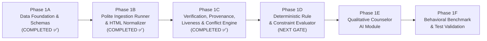

# Phase 1: Core Scholarship Intelligence Engine

**Project:** Scholarship Discovery, Verification & Counselor Platform  
**Governing Standard:** `Antigravity Phase 0 — Skills-Aware Addendum.md` & Phase 1 Prompts  
**Active Sub-Phase:** Phase 1C Complete (`READY_FOR_PHASE_1D` — Awaiting Phase 1D Gate Authorization)  

---

## 1. Phase 1 Overview

Phase 1 establishes the deterministic, high-fidelity core intelligence engine for the Scholarship Discovery Platform. It transforms ambiguous scholarship aggregations into a rigorous, verifiable system of record for **international students seeking U.S. undergraduate financial aid and scholarships**.

Rather than attempting broad, noisy web-scraping across thousands of unverified web pages, Phase 1 builds from a controlled, high-value seed dataset of authentic U.S. undergraduate opportunities.

---

## 2. Completed Sub-Phases

### Phase 1A: Data Architecture & Schemas (COMPLETED ✅)
1. **Canonical Domain Models & TriState Semantics:** Multi-state values (`YES`, `NO`, `UNKNOWN`, `NOT_APPLICABLE`, `CONFLICTING`) preventing missing facts from becoming false assumptions.
2. **Pydantic v2 Schemas:** Strict validation across all domain entities.
3. **Portable SQLAlchemy ORM Models:** Database-agnostic relational schema compatible with PostgreSQL and SQLite.
4. **Alembic Reproducible Migrations:** Deterministic migrations from empty database to production-ready tables.
5. **Idempotent Seed Loader & Dataset:** 18 verified, authentic U.S. undergraduate financial aid opportunities with traceable source provenance.
6. **Bounded Eligibility Rule Grammar:** Safe AST expressions with maximum nesting depth bounded to 5 levels (zero arbitrary code execution).
7. **Privacy-by-Design Student Profile:** Strict data minimization with zero passwords, banking credentials, or SSNs.

### Phase 1B: Ingestion Runner & Evidence Staging (COMPLETED ✅)
1. **PoliteHttpClient:** Chunked 16 KB streaming response cap (stops immediately at 5 MB without buffering into RAM), conservative default delay (0.5s), bounded backoff, narrow exception handling.
2. **HtmlExtractor:** Clean structural DOM decomposition into sections, metadata, and tables with boilerplate removal.
3. **CandidateNormalizer:** Extracts candidate deadlines, decomposed funding, and prerequisites while preserving `UNKNOWN`.
4. **Candidate Staging Envelope:** Candidate opportunities strictly isolated in staging with mandatory `CandidateEvidence` anchors; never overwriting canonical data.

### Phase 1C: Verification, Provenance, Liveness & Conflict Resolution (COMPLETED ✅)
1. **Source Authority Hierarchy:** 5-tier classification (`OFFICIAL_PROVIDER` > `OFFICIAL_UNIVERSITY` > `GOVERNMENT` > `DISCOVERY_AGGREGATOR` > `THIRD_PARTY`).
2. **Source Liveness & Soft-404 Inspection:** Comprehensive HTTP sweep, bounded redirect tracking (max 5 hops), and deep body soft-404 inspection. Evidence is never deleted when a source fails.
3. **Deterministic Conflict Resolution:** Explainable rules favoring official providers and current cycle recency. Unresolved disagreements remain `CONFLICTING` with both sources preserved in `ConflictRecord`. Zero numeric trust formulas.
4. **Canonical Promoter & Overwrite Protection:** Verified candidate facts are promoted with immutable provenance; verified canonical facts are strictly protected from unsafe overwrites.
5. **Historical Audit Trail:** `VerificationHistory` captures all canonical fact replacements (`old_value`, `new_value`, `old_evidence`, `new_evidence`, `reason`, `changed_at`).
6. **102/102 Passing Tests:** 100% offline reproducible test suite with zero failures.

---

## 3. Upcoming Sub-Phases (1D – 1F)

- **Phase 1D (Eligibility & Constraint Evaluator):** Deterministic execution of the AST rule grammar against student profiles, preserving `UNKNOWN`.
- **Phase 1E (Qualitative Counselor Module):** 5-dimensional qualitative evaluation (Eligibility, Fit, Competitiveness, Readiness, Confidence) without fake numerical precision.
- **Phase 1F (Comprehensive Verification & Benchmarking):** Execution of formal specification test cases and empirical latency benchmarking over the seed dataset.

---

## 4. Architectural Boundaries & Deliberate Exclusions

To maintain focus and eliminate unnecessary complexity:
- **No API Routes / FastAPI App:** Deferred until engine modules are fully test-verified.
- **No Web Frontend (Next.js):** Deferred to Phase 2.
- **No Vector Databases / Embeddings / pgvector:** Deferred to Phase 4 / future scale.
- **No Distributed Brokers (Redis, Celery, Kafka):** Verification runs synchronously in-process.
- **No Headless Browser Farms (Playwright/Puppeteer):** Static fetching with offline fixtures.
- **No LLM Generative Inference / Hallucination:** Deferred to structured prompts in Phase 1E.
