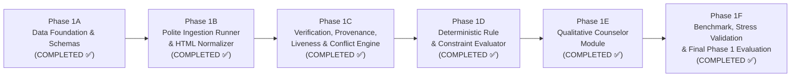

# Phase 1: Core Scholarship Intelligence Engine

**Project:** Scholarship Discovery, Verification & Counselor Platform  
**Governing Standard:** `Antigravity Phase 0 — Skills-Aware Addendum.md` & Phase 1 Prompts  
**Active Sub-Phase:** Phase 1 Complete (`PHASE_1_COMPLETE = YES`, `READY_FOR_PHASE_2 = YES` — Awaiting Explicit User Gate Authorization)  

---

## 1. Phase 1 Overview

Phase 1 establishes the deterministic, high-fidelity core intelligence engine for the Scholarship Discovery Platform. It transforms ambiguous scholarship aggregations into a rigorous, verifiable system of record for **international students seeking U.S. undergraduate financial aid and scholarships**.

Rather than attempting broad, noisy web-scraping across thousands of unverified web pages, Phase 1 builds from a controlled, high-value seed dataset of authentic U.S. undergraduate opportunities.

---

## 2. Completed Sub-Phases

### Phase 1A: Data Architecture & Schemas (COMPLETED ✅)
1. **Canonical Domain Models & TriState Semantics:** Multi-state values (`YES`, `NO`, `UNKNOWN`, `NOT_APPLICABLE`, `CONFLICTING`) preventing missing facts from becoming false assumptions.
2. **Pydantic v2 Schemas:** Strict validation across all domain entities.
3. **Portable SQLAlchemy ORM Models:** Database-agnostic relational schema compatible with PostgreSQL and SQLite.
4. **Alembic Reproducible Migrations:** Deterministic migrations from empty database to production-ready tables.
5. **Idempotent Seed Loader & Dataset:** 18 verified, authentic U.S. undergraduate financial aid opportunities with traceable source provenance.
6. **Bounded Eligibility Rule Grammar:** Safe AST expressions with maximum nesting depth bounded to 5 levels (zero arbitrary code execution).
7. **Privacy-by-Design Student Profile:** Strict data minimization with zero passwords, banking credentials, or SSNs.

### Phase 1B: Ingestion Runner & Evidence Staging (COMPLETED ✅)
1. **PoliteHttpClient:** Chunked 16 KB streaming response cap (stops immediately at 5 MB without buffering into RAM), conservative default delay (0.5s), bounded backoff, narrow exception handling.
2. **HtmlExtractor:** Clean structural DOM decomposition into sections, metadata, and tables with boilerplate removal.
3. **CandidateNormalizer:** Extracts candidate deadlines, decomposed funding, and prerequisites while preserving `UNKNOWN`.
4. **Candidate Staging Envelope:** Candidate opportunities strictly isolated in staging with mandatory `CandidateEvidence` anchors; never overwriting canonical data.

### Phase 1C: Verification, Provenance, Liveness & Conflict Resolution (COMPLETED ✅)
1. **Source Authority Hierarchy:** 5-tier classification (`OFFICIAL_PROVIDER` > `OFFICIAL_UNIVERSITY` > `GOVERNMENT` > `DISCOVERY_AGGREGATOR` > `THIRD_PARTY`).
2. **Source Liveness & Soft-404 Inspection:** Comprehensive HTTP sweep, bounded redirect tracking (max 5 hops), and deep body soft-404 inspection. Evidence is never deleted when a source fails.
3. **Deterministic Conflict Resolution:** Explainable rules favoring official providers and current cycle recency. Unresolved disagreements remain `CONFLICTING` with both sources preserved in `ConflictRecord`. Zero numeric trust formulas.
4. **Canonical Promoter & Overwrite Protection:** Verified candidate facts are promoted with immutable provenance; verified canonical facts are strictly protected from unsafe overwrites.
5. **Historical Audit Trail:** `VerificationHistory` captures all canonical fact replacements (`old_value`, `new_value`, `old_evidence`, `new_evidence`, `reason`, `changed_at`).
6. **102 Passing Tests:** 100% offline reproducible test suite with zero failures.

### Phase 1D: Deterministic Eligibility Evaluation Engine (COMPLETED ✅)
1. **Deterministic Logic Engine:** Evaluates verified rules against student profiles; 100% reproducible with zero LLM calls, random elements, or probabilistic outputs.
2. **Multi-Valued Logic Truth Tables:** Formal 5x5 truth tables for `AND`, `OR`, `NOT` across `YES`, `NO`, `UNKNOWN`, `NOT_APPLICABLE`, `CONFLICTING`.
3. **Uncertainty Preservation:** Missing profile information strictly yields `UNKNOWN` and aggregates to `NEEDS_INFORMATION`. Missing info never equals `NO`.
4. **Scale-Aware Comparisons & Membership:** Scale-aware GPA evaluation, strict field allowlist, case-insensitive country aliases, `IN` and `CONTAINS` operators.
5. **Verification & Academic Cycle Gating:** Unverified, outdated, conflicting, or quarantined opportunities are gated; cycle mismatches return `OUTDATED_CYCLE`.
6. **Deterministic Explanations:** Template-based explanations citing rule IDs, requirements, student actual values, and source evidence quotes.
7. **143/143 Passing Tests:** 41 dedicated Phase 1D tests + 102 prior tests passing with zero regressions.

### Phase 1E: Qualitative Scholarship Counselor Module (COMPLETED ✅)
1. **Deterministic Qualitative Counselor:** Transparent guidance on strengths, gaps, missing information, application readiness, and actionable next steps.
2. **Strict Conceptual Separation:** `Eligibility != Competitiveness != Fit != Readiness`. Zero conflation into a single score.
3. **Zero Numerical Scoring or Probabilities:** Complete ban on `fit_score`, `match_score`, `competitiveness_score`, rankings, and acceptance chances.
4. **Full Tuition != Full Funding Invariant:** If room, meals, and living expenses are not verified, awards are labeled `FULL_TUITION` with a mandatory living cost warning.
5. **Preservation of UNKNOWN:** Missing facts or unstated requirements remain `UNKNOWN` rather than negative assumptions.
6. **Multi-Deadline Assessment:** Distinct application and financial aid deadlines evaluated independently with a 14-day deterministic closing-soon threshold.
7. **Source-Aware Provenance:** Evidence quotes and authority tiers attached to every factual assertion.
8. **172/172 Passing Tests:** 29 dedicated Phase 1E tests (including 8 golden test cases, 100-run determinism test, and AST security audit) + 143 prior tests passing with zero regressions.

### Phase 1F: Benchmark, Stress Validation & Final Phase 1 Evaluation (COMPLETED ✅)
1. **22 Benchmarks (A through V):** End-to-end evaluation covering all functional, epistemic, and edge scenarios.
2. **Adversarial & Property-Style Validation:** Resilient against empty profiles, missing relations, malformed ASTs, and out-of-bounds inputs.
3. **Epistemic Invariants:** `UNKNOWN != NO`, `UNKNOWN != YES`, `UNKNOWN != NOT_APPLICABLE`, `CONFLICTING != NO`, `CONFLICTING != YES` strictly maintained.
4. **Phase 1D -> 1E Contract Preservation:** Phase 1E preserves all 6 eligibility engine statuses without alteration.
5. **Verification State Gating:** All 7 verification states gated and surfaced with transparent warning notices.
6. **Stress & Throughput:** 250 end-to-end evaluations across 50 opportunities and 5 profiles completed in 0.43s (~1.7ms / eval).
7. **Static Security & Quality Audit:** Clean AST inspection with zero `eval`, `exec`, `compile`, or `__import__`, zero LLM/vector dependencies, and zero prohibited score attributes.
8. **238/238 Passing Tests:** 56 dedicated Phase 1F validation tests + 182 prior tests passing with zero regressions.

---

## 3. Transition to Phase 2

Phase 1 backend is fully validated and locked. Transition to Phase 2 (FastAPI application, Student Accounts & Web Frontend) is awaiting explicit user authorization.

## 4. Architectural Boundaries & Deliberate Exclusions

To maintain focus and eliminate unnecessary complexity:
- **No API Routes / FastAPI App:** Deferred until engine modules are fully test-verified.
- **No Web Frontend (Next.js):** Deferred to Phase 2.
- **No Vector Databases / Embeddings / pgvector:** Deferred to Phase 4 / future scale.
- **No Distributed Brokers (Redis, Celery, Kafka):** Verification runs synchronously in-process.
- **No Headless Browser Farms (Playwright/Puppeteer):** Static fetching with offline fixtures.
- **No LLM Generative Inference / Hallucination:** Deferred to structured prompts in Phase 1E.
