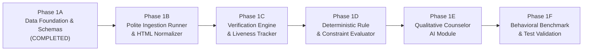

# Phase 1: Core Scholarship Intelligence Engine

**Project:** Scholarship Discovery, Verification & Counselor Platform  
**Governing Standard:** `Antigravity Phase 0 — Skills-Aware Addendum.md` & `Phase 1A — Production Implementation Prompt.md`  
**Lead Engineer & Architect:** Senior Software Engineer, Technical Lead, Data Architect  
**Active Sub-Phase:** Phase 1A (Data Foundation & Schema Architecture)  

---

## 1. Phase 1 Overview

Phase 1 establishes the deterministic, high-fidelity core intelligence engine for the Scholarship Discovery Platform. It transforms ambiguous scholarship aggregations into a rigorous, verifiable system of record for **international students seeking U.S. undergraduate financial aid and scholarships**.

Rather than attempting broad, noisy web-scraping across thousands of unverified web pages, Phase 1 builds from a controlled, high-value seed dataset of authentic U.S. undergraduate opportunities.

---

## 2. Phase 1A Scope (Active Implementation)

Phase 1A delivers the complete foundational data layer:
1. **Canonical Domain Models & TriState Semantics:** Multi-state values (`YES`, `NO`, `UNKNOWN`, `NOT_APPLICABLE`, `CONFLICTING`) preventing missing facts from becoming false assumptions.
2. **Pydantic v2 Schemas:** Strict input/output validation across all 14 domain entities.
3. **Portable SQLAlchemy ORM Models:** Database-agnostic relational schema compatible with PostgreSQL and SQLite.
4. **Alembic Reproducible Migrations:** Deterministic migrations from empty database to production-ready tables.
5. **Idempotent Seed Loader & Dataset:** 18 verified, authentic U.S. undergraduate financial aid opportunities with traceable source provenance.
6. **Bounded Eligibility Rule Grammar:** Safe AST expressions (`AND`, `OR`, `NOT`, `EQ`, `GTE`, etc.) with maximum nesting depth bounded to 5 levels (zero arbitrary code execution).
7. **Privacy-by-Design Student Profile:** Strict data minimization with zero passwords, banking credentials, SSNs, or premature vector embeddings.
8. **Automated Pytest Suite:** 33 tests verifying schemas, idempotency, migrations, and enforcing the No-Fabrication Acceptance Test.

---

## 3. Future Sub-Phases (1B – 1F)

- **Phase 1B (Ingestion Runner & Normalizer):** Static HTML extraction with HTTPX, BeautifulSoup, and curated fallback for bot-protected institutional pages.
- **Phase 1C (Verification & Provenance Engine):** Periodic HTTP `HEAD` liveness sweeps, soft-404 regex detection, and citation anchoring.
- **Phase 1D (Eligibility & Constraint Evaluator):** Deterministic execution of the AST rule grammar against student profiles, preserving `UNKNOWN`.
- **Phase 1E (Qualitative Counselor Module):** 5-dimensional qualitative evaluation (Eligibility, Fit, Competitiveness, Readiness, Confidence) without fake numerical precision.
- **Phase 1F (Comprehensive Verification & Benchmarking):** Execution of the 20 formal specification test cases and empirical latency benchmarking over the seed dataset.

---

## 4. Architectural Boundaries & Deliberate Exclusions

To prevent premature distributed complexity for a solo developer, Phase 1 enforces strict boundaries:
- **No API Routes / FastAPI App:** Excluded in Phase 1A (deferred until engine modules are fully test-verified).
- **No Web Frontend (Next.js):** Deferred to Phase 2.
- **No Vector Databases / Embeddings / pgvector:** Deferred to Phase 4 / future scale.
- **No Distributed Brokers (Redis, Celery):** Ingestion runs synchronously or in-process.
- **No Headless Browser Farms (Playwright):** Phase 1 relies on HTTPX static fetching and curated manual fallback.
- **No LLM Generative Inference / Hallucination:** Deferred to structured prompts in Phase 1E.
