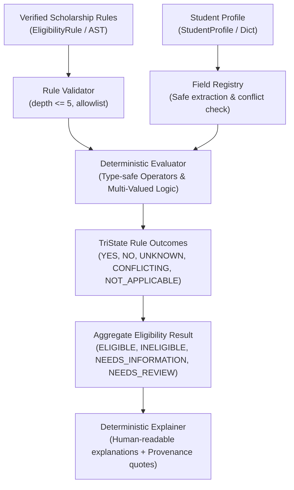

# Phase 1D Implementation Report — Deterministic Eligibility Evaluation Engine

**Project:** Scholarship Discovery, Verification & Counselor Platform  
**Phase:** 1D (Deterministic Eligibility Evaluation Engine)  
**Status:** `READY_FOR_PHASE_1E`  
**Date:** September 2026  
**Governing Standard:** `Antigravity — Phase 1D Production Implementation Prompt.md`

---

## A. Objective

Phase 1D implements a pure Python, deterministic eligibility evaluation engine that evaluates verified scholarship eligibility rules against student profiles. The engine answers exactly one question:

> **"Based on the information currently available, does this student satisfy the verified eligibility rules for this opportunity?"**

It strictly separates **Eligibility** from **Competitiveness**, **Fit**, and **Recommendations**:
- It does **NOT** generate numerical probabilities (e.g. "80% chance of winning").
- It does **NOT** calculate ranking, match scores, or fit scores.
- It does **NOT** use language models (LLMs), external APIs, vector embeddings, or probabilistic heuristics.
- It is 100% deterministic, explainable, reproducible, and evidence-aware.

---

## B. Architecture

The evaluation pipeline follows a strict unidirectional dataflow:



### Module Organization
- `scholarship_intelligence/evaluator/logic.py`: Multi-valued logic truth tables for `AND`, `OR`, `NOT` across all 5 states (`YES`, `NO`, `UNKNOWN`, `NOT_APPLICABLE`, `CONFLICTING`).
- `scholarship_intelligence/evaluator/operators.py`: Type-safe comparison (`EQ`, `NEQ`, `GT`, `GTE`, `LT`, `LTE`), membership (`IN`), and containment (`CONTAINS`) operators with scale-aware GPA evaluation.
- `scholarship_intelligence/evaluator/field_registry.py`: Strict allowlist of permissible student profile fields, aliases, and safe attribute resolution without arbitrary `getattr` or object traversal.
- `scholarship_intelligence/evaluator/validator.py`: Bounded AST expression validator enforcing depth $\le 5$, valid operators, operand counts, and type compatibility prior to evaluation.
- `scholarship_intelligence/evaluator/explainer.py`: Deterministic template-based human-readable explanation generator citing rule IDs, requirements, student values, and source evidence quotes.
- `scholarship_intelligence/evaluator/engine.py`: Core `EligibilityEvaluator` supporting single rule execution, opportunity evaluation, verification-state gating, academic-cycle gating, and status aggregation.
- `scholarship_intelligence/schemas/eligibility_eval.py`: Canonical Pydantic schemas (`EligibilityStatus`, `RuleEvaluationResult`, `EligibilityEvaluationResult`).

---

## C. Rule Grammar & Supported Operators

The engine consumes bounded structured Abstract Syntax Trees (AST) established in Phase 1A. No arbitrary rule strings or dynamic code fragments are executed.

### 1. Logical Operators
- `AND`: Conjunction across 2 or more sub-expressions.
- `OR`: Disjunction across 2 or more sub-expressions.
- `NOT`: Negation on exactly 1 sub-expression.

### 2. Comparison & Membership Operators
- `EQ`: Exact value equality (case-insensitive string comparison, country alias resolution).
- `NEQ`: Inequality constraint.
- `GT`: Greater than (numeric float/int).
- `GTE`: Greater than or equal to (numeric float/int).
- `LT`: Less than (numeric float/int).
- `LTE`: Less than or equal to (numeric float/int).
- `IN`: Set/list membership test (e.g. nationality in country code/name list).
- `CONTAINS`: Substring or list collection containment (e.g. interests or academic achievements).

### 3. Nesting Depth Boundary
Maximum nesting depth is strictly enforced at **5 levels**. Any rule expression exceeding depth 5 is rejected with `RuleValidationError` prior to evaluation.

---

## D. TriState Multi-Valued Logic Semantics

The engine implements formal multi-valued logic over 5 distinct states:
1. `YES`: Condition is verified to be satisfied.
2. `NO`: Condition is verified not to be satisfied.
3. `UNKNOWN`: Information is insufficient or unprovided. Missing data does **NOT** equal `NO`.
4. `NOT_APPLICABLE`: Condition does not apply to this evaluation context (neutral element).
5. `CONFLICTING`: Contradictory verified evidence or student data exists.

### 1. Conjunction (AND)
- `NO` is an absorbing element (a false conjunct renders the conjunction `NO` unconditionally).
- `NOT_APPLICABLE` acts as identity (neutral element).
- `CONFLICTING` dominates `UNKNOWN` and `YES`.
- `UNKNOWN` dominates `YES`.

| AND | YES | NO | UNKNOWN | NOT_APPLICABLE | CONFLICTING |
|---|---|---|---|---|---|
| **YES** | YES | NO | UNKNOWN | YES | CONFLICTING |
| **NO** | NO | NO | NO | NO | NO |
| **UNKNOWN** | UNKNOWN | NO | UNKNOWN | UNKNOWN | CONFLICTING |
| **NOT_APPLICABLE** | YES | NO | UNKNOWN | NOT_APPLICABLE | CONFLICTING |
| **CONFLICTING** | CONFLICTING | NO | CONFLICTING | CONFLICTING | CONFLICTING |

### 2. Disjunction (OR)
- `YES` is an absorbing element (a true disjunct satisfies the disjunction unconditionally).
- `NOT_APPLICABLE` acts as identity (neutral element).
- `CONFLICTING` dominates `UNKNOWN` and `NO`.
- `UNKNOWN` dominates `NO`.

| OR | YES | NO | UNKNOWN | NOT_APPLICABLE | CONFLICTING |
|---|---|---|---|---|---|
| **YES** | YES | YES | YES | YES | YES |
| **NO** | YES | NO | UNKNOWN | NO | CONFLICTING |
| **UNKNOWN** | YES | UNKNOWN | UNKNOWN | UNKNOWN | CONFLICTING |
| **NOT_APPLICABLE** | YES | NO | UNKNOWN | NOT_APPLICABLE | CONFLICTING |
| **CONFLICTING** | YES | CONFLICTING | CONFLICTING | CONFLICTING | CONFLICTING |

### 3. Negation (NOT)
Negation reflects truth values and strictly preserves uncertainty:

| State | NOT(State) | Rationale |
|---|---|---|
| **YES** | NO | Inverted truth |
| **NO** | YES | Inverted falsity |
| **UNKNOWN** | UNKNOWN | Negating unknown information remains unknown (`NOT UNKNOWN != YES`) |
| **NOT_APPLICABLE** | NOT_APPLICABLE | Out-of-band sentinel preserved |
| **CONFLICTING** | CONFLICTING | Negating contradictory data remains contradictory |

---

## E. Overall Eligibility Aggregation Semantics

When aggregating across multiple rules for an opportunity, rules are partitioned by `kind` (`REQUIRED`, `CONDITIONAL`, `PREFERRED`):

1. **`INELIGIBLE`**: At least one `REQUIRED` rule evaluates to `NO`. (Immediate non-satisfaction of mandatory criteria).
2. **`NEEDS_REVIEW`**: No `REQUIRED` rule is `NO`, but at least one `REQUIRED` rule evaluates to `CONFLICTING`.
3. **`NEEDS_INFORMATION`**: No `REQUIRED` rule is `NO` or `CONFLICTING`, but at least one `REQUIRED` rule evaluates to `UNKNOWN`.
4. **`ELIGIBLE`**: All `REQUIRED` rules evaluate to `YES` (or `NOT_APPLICABLE`).
5. **Supplementary Rules (`CONDITIONAL`, `PREFERRED`)**:
   - Failure to meet a `CONDITIONAL` or `PREFERRED` rule does **NOT** disqualify an otherwise eligible student.
   - Evaluated outcomes are isolated in `supplementary_rules` with clear descriptive notes.

---

## F. Unknown Semantics: Missing Data is NOT Ineligibility

A fundamental architectural invariant of the Scholarship Intelligence Platform is:

> **Missing information != Ineligible**

If an opportunity requires `GPA >= 3.5` and the student profile omits GPA, the evaluator outputs:
- Rule outcome: `UNKNOWN`
- Overall status: `NEEDS_INFORMATION`
- Explanation: `"Information Needed: The scholarship requires gpa (GTE 3.5 on 4.0 scale), but student's gpa has not been provided."`

The student is **never** labeled `INELIGIBLE` due to missing data. This preserves actionable next steps for counselors and students in future phases.

---

## G. Conflict Semantics

Contradictory student information (e.g. multiple distinct nationalities for a scalar field, or explicit conflict flags) or contradictory official evidence:
- Evaluates directly to `CONFLICTING`.
- Aggregates to `NEEDS_REVIEW`.
- Produces deterministic explanations instructing that data discrepancy must be resolved before eligibility can be established.
- The engine never guesses or picks one conflicting value over another.

---

## H. Verification-State Gating & Uncertainty Flagging

The evaluator protects students from unreliable or unverified data:
- `VERIFIED`: Permitted for normal evaluation.
- `PARTIALLY_VERIFIED`:
  - Default: Gated (`GATED_UNVERIFIED`).
  - When `allow_partially_verified=True`: Evaluates with a dedicated uncertainty indicator:
    - Sets `evaluation_contains_unverified_facts = True` on `EligibilityEvaluationResult`.
    - Tracks `is_verified` per rule on `RuleEvaluationResult`.
    - Injects top-level advisory warning: `"[WARNING] Evaluation contains unverified facts: Opportunity or underlying rule(s) are only PARTIALLY_VERIFIED. Findings must be confirmed against primary official sources before application."`
    - Sets `"evaluation_contains_unverified_facts": True` in `audit_metadata`.
- `UNVERIFIED`: Gated (`GATED_UNVERIFIED`). Rules are not evaluated as verified truth.
- `OUTDATED`: Gated (`GATED_UNVERIFIED`). Rules must be reverified before evaluation.
- `CONFLICTING`: Gated (`NEEDS_REVIEW`). Unresolved evidence conflict blocks evaluation.
- `SOURCE_UNAVAILABLE`: Gated (`GATED_UNVERIFIED`). Dead official sources prevent verification assurance.
- `QUARANTINED_FOR_REVIEW`: Gated (`NEEDS_REVIEW`). Material compliance/risk concerns prevent rule evaluation.

---

## I. Academic-Cycle Compatibility

Eligibility rules are tied to specific academic cycles (e.g. `2026-2027`):
- If an opportunity was verified for `2024-2025` and evaluated against target cycle `2026-2027`, the evaluator returns `OUTDATED_CYCLE` (`is_gated=True`).
- Explains: `"Evaluation blocked: Academic cycle mismatch. Opportunity is verified for cycle '2024-2025', but target evaluation cycle is '2026-2027'. Rules cannot be assumed valid for different academic years."`

---

## J. Human-Readable Explanations with Provenance Quotes

All explanations are generated from deterministic string templates. Zero LLMs are used.

### Example 1: Clearly Ineligible (Rule Failed)
```text
Overall Decision: INELIGIBLE. Failed 1 required eligibility condition(s).
Unsatisfied: The scholarship requires gpa GTE 3.5 (on 4.0 scale), but student has 3.2 (Rule: r_gpa). [Source Evidence: "Applicants must present a cumulative GPA of 3.5 or higher on a 4.0 scale."]
Satisfied: Student citizenship_country 'ETH' is in allowed criteria ['ETH', 'KEN', 'UGA'] (Rule: r_nationality). [Source Evidence: "Open to citizens and permanent residents of Ethiopia, Kenya, and Uganda."]
```

### Example 2: Missing Information (Needs Information)
```text
Overall Decision: NEEDS_INFORMATION. Missing student profile data for 1 required condition(s).
Information Needed: The scholarship requires gpa (GTE 3.5 on 4.0 scale), but student's gpa has not been provided (Rule: r_gpa). [Source Evidence: "Applicants must present a cumulative GPA of 3.5 or higher on a 4.0 scale."]
```

### Example 3: Preferred Rule Unmet (Still Eligible)
```text
Overall Decision: ELIGIBLE. Satisfied all 2 verified required eligibility condition(s).
Satisfied: Student gpa of 3.85 satisfies requirement (GTE 3.5 on 4.0 scale) (Rule: r_gpa).
Satisfied: Student citizenship_country 'KEN' is in allowed criteria ['ETH', 'KEN', 'UGA'] (Rule: r_nationality).
[PREFERRED] Unsatisfied: The scholarship requires sat_score GTE 1500, but student profile has '1400' (Rule: r_sat_pref). [Source Evidence: "Competitive applicants typically have SAT scores of 1500 or above."]
```

---

## K. Security & Sandbox Controls

1. **Zero Dynamic Execution:**
   - Evaluator codebase is verified via AST parsing in `test_evaluator_safety.py` to ensure zero calls to `eval`, `exec`, `compile`, `system`, `popen`, or `spawn`.
2. **Strict Field Allowlist:**
   - Only registered attributes in `REGISTERED_FIELDS` (`gpa`, `citizenship_country`, `sat_score`, etc.) can be referenced.
   - Arbitrary attribute traversal (`__class__`, `__dict__`, `mro`) is rejected with `RuleValidationError`.
3. **Bounded Recursion Depth:**
   - AST nesting depth is capped at 5 levels, preventing denial-of-service stack overflow attacks.
4. **Scale-Aware Comparisons:**
   - Scale mismatches without defined conversion rules return `UNKNOWN` rather than arbitrary mathematical conversion.

---

## L. Tests & Validation Results

Test Suite Command:
```bash
.venv/bin/pytest -v
```

Summary:
- Phase 1A tests: **25 passed**
- Phase 1B tests: **32 passed**
- Phase 1C tests: **45 passed**
- Phase 1D tests: **41 passed**
  - `test_evaluator_truth_tables.py` (7 tests covering full 25 AND, 25 OR, 5 NOT, multi-operand, commutativity, identity)
  - `test_evaluator_comparisons.py` (5 tests covering numeric comparisons, GPA scale mismatch, IN, CONTAINS, missing values)
  - `test_evaluator_unknown_semantics.py` (3 tests covering missing profile fields, negating unknown, aggregation to NEEDS_INFORMATION)
  - `test_evaluator_conflicts.py` (3 tests covering explicit flags, implicit contradictory scalar lists, aggregation to NEEDS_REVIEW)
  - `test_evaluator_validation.py` (6 tests covering depth limit > 5, invalid operator, unregistered field, operand counts)
  - `test_evaluator_safety.py` (2 tests covering AST codebase inspection, injection attempts)
  - `test_evaluator_golden_cases.py` (10 tests covering Golden Cases A through H, PARTIALLY_VERIFIED uncertainty flagging, and unverified rule flagging)
  - `test_evaluator_determinism.py` (1 test covering 100-run identical outcome reproducibility)

**Total: 143 passed in 3.19s (0 failures)**

---

## M. Regression Verification

- All Phase 1A schemas, ORM models, and seed migrations remain 100% intact and passing.
- All Phase 1B chunked streaming, extraction, and normalization invariants remain passing.
- All Phase 1C authority ranking, liveness, soft-404, conflict resolution, and promotion tests remain passing.
- Total test count expanded from 102 to 143 tests with zero regressions.

---

## N. Strict Scope Boundary Confirmation

Phase 1D adheres strictly to its boundaries:
- ❌ Zero counselor AI or LLM prompts.
- ❌ Zero recommendation, ranking, or match/fit scoring.
- ❌ Zero acceptance probabilities or competitiveness calculations.
- ❌ Zero vector databases, pgvector, or embeddings.
- ❌ Zero UI, frontend, or web endpoints.
- ❌ Phase 1E was NOT started.

---

## O. Known Limitations

1. **GPA Scale Conversions:** The engine does not automatically convert foreign grading scales (e.g. 20-point French Baccalaureate, Indian percentage, or UK classifications) to a 4.0 scale. Without an explicit verified conversion rule, scale mismatches correctly evaluate as `UNKNOWN`.
2. **Composite Field Dependencies:** Inter-field constraints (e.g. "SAT required if GPA < 3.5") are fully supported through explicit `OR` / `AND` AST structures, but natural language descriptions must first be structured into AST expressions before the evaluator can process them.
3. **In-Memory Audit:** Evaluation results are produced as structured Pydantic objects. Long-term persistent storage of application tracking history is deferred to Phase 2.

---

## P. Final Verdict

```text
READY_FOR_PHASE_1E
```
