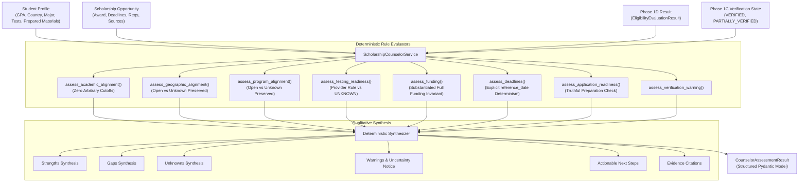

# Phase 1E Implementation Report — Qualitative Scholarship Counselor Module

**Project:** Scholarship Discovery, Verification & Counselor Platform  
**Phase:** 1E (Qualitative Scholarship Counselor Module)  
**Status:** `READY_FOR_PHASE_1F`  
**Date:** September 2026  
**Governing Standard:** `Antigravity — Phase 1E Production Implementation Prompt.md`

---

## 1. Executive Summary

Phase 1E implements the **Qualitative Scholarship Counselor Module**, providing deterministic, explainable, evidence-backed qualitative guidance for international undergraduate applicants.

The module answers five foundational student questions without ever resorting to black-box machine learning, probabilistic scores, or fabricated assumptions:
1. **Relevance & Strengths:** *"Why is this scholarship relevant to me, and what are my strongest alignments?"*
2. **Missing Facts & Requirements:** *"What requirements do I already satisfy, and what information is still missing from my profile?"*
3. **Application Readiness:** *"What application materials and standardized tests do I need to prepare?"*
4. **Funding Breakdown:** *"What does the award actually cover (tuition vs. living expenses), and is it renewable?"*
5. **Actionable Next Steps:** *"What concrete actions should I take next, and which deadlines are approaching?"*

### Absolute Invariants Enforced
- **Eligibility $\ne$ Competitiveness $\ne$ Fit $\ne$ Readiness:** A student may be 100% eligible yet have limited program fit or need test preparation. These dimensions are never conflated into a single metric.
- **Zero Numerical Scoring:** No `match_score`, `fit_score`, `competitiveness_score`, `readiness_score`, `confidence_score`, or `trust_score`.
- **Zero Probability Predictions:** No acceptance chances (e.g. "80% chance of winning") or top-X rankings.
- **Zero LLM / Vector Dependencies:** Pure deterministic Python logic using domain models and Pydantic schemas.
- **No Invented Academic or Testing Standards:** No arbitrary GPA cutoffs (3.5, 3.8, or +0.2 point margins) and no universal SAT 1400 / ACT 30 thresholds. Assessments strictly evaluate against verified provider requirements.
- **Epistemic Integrity (`UNKNOWN \ne NO`):** Missing student facts or unextracted provider criteria remain `UNKNOWN`. Absence of an explicit rule is never assumed to mean "open to all."
- **Substantiated Full Funding Invariant:** Awards labeled `FULL_FUNDING` are downgraded to `FULL_TUITION` unless verified funding components substantiate both tuition and comprehensive living support (room + meals or living stipend).
- **Truthful Application Readiness:** Checks actual student document preparation state (`prepared_materials`); if preparation status is unrecorded, readiness is reported as `UNKNOWN` rather than assuming documents are missing.
- **Source Traceability & Genuine Evidence:** Every factual finding cites source authority with verbatim evidence snippets; zero generic placeholder quotes.

---

## 2. Architecture & Module Structure

The counselor sits downstream of Phase 1D Eligibility Evaluation and Phase 1C Verification:



### Module Organization
- `scholarship_intelligence/domain/enums.py`: Core qualitative classifications (`AlignmentLevel`, `ReadinessLevel`, `DeadlineReadiness`).
- `scholarship_intelligence/counselor/enums.py`: Re-exports domain counselor enums for client convenience.
- `scholarship_intelligence/schemas/counselor.py`: Pydantic V2 context schemas and canonical output container `CounselorAssessmentResult`.
- `scholarship_intelligence/counselor/rules.py`: Independent, inspectable, deterministic assessment rules for each counselor dimension.
- `scholarship_intelligence/counselor/service.py`: Orchestrator synthesizing multi-dimensional evaluations, warnings, and provenance references.
- `scholarship_intelligence/counselor/__init__.py`: Public package interface exposing `ScholarshipCounselorService` and result schemas.

---

## 3. The Seven Assessment Dimensions (Epistemic Calibration)

### 1. Academic Alignment
Evaluates student GPA strictly against verified provider criteria without arbitrary thresholds:
- `STRONG`: Student GPA meets or exceeds the published minimum requirement.
- `LIMITED`: Student GPA is below the published minimum requirement.
- `UNKNOWN`: Student GPA is unprovided, or grading scale cannot be normalized against published requirements.
- `NOT_ASSESSABLE`: Opportunity publishes no minimum GPA requirement. The system explains: *"The opportunity does not publish a minimum GPA requirement, so the system cannot determine academic alignment from GPA alone."* (No invented 3.5, 3.8, or +0.2 rules).

### 2. Geographic Alignment
Evaluates citizenship and residency criteria with rigorous distinction between open and unknown:
- `STRONG`: Student citizenship/residence matches verified eligible geographic criteria.
- `LIMITED`: Student citizenship is outside published eligible countries.
- `NOT_ASSESSABLE`: Opportunity is verified as open to international applicants without regional restrictions (`international_students_allowed == YES`).
- `UNKNOWN`: No geographic eligibility rules were extracted and international eligibility is unconfirmed (`international_students_allowed == UNKNOWN`). Absence of a rule is never assumed to mean unrestricted access.

### 3. Program of Study Alignment
Evaluates intended major against eligible academic disciplines:
- `STRONG`: Declared major matches verified eligible fields of study.
- `LIMITED`: Declared major is outside published eligible programs.
- `NOT_ASSESSABLE`: Opportunity is explicitly verified as open across all undergraduate fields of study (`is_open_to_all_majors == True`).
- `UNKNOWN`: No field restriction was extracted or published. The system notes: *"No specific field-of-study restriction was extracted or published; confirm eligible academic programs directly with the provider."*

### 4. Testing Readiness
Evaluates standardized tests (SAT/ACT) against verified provider policies, eliminating arbitrary 1400/30 benchmarks:
- `NOT_APPLICABLE`: Provider confirms testing is not required (`requires_sat == NO and requires_act == NO`).
- `UNKNOWN`: Provider testing requirement is unconfirmed (`requires_sat == UNKNOWN and requires_act == UNKNOWN`).
- `READY`: Standardized testing is required and student has completed the exam (or satisfies an explicit published minimum score threshold).
- `NEEDS_PREPARATION`: Standardized testing is required by the provider, but no scores are recorded on the student profile (or score falls below the verified minimum).

### 5. Funding Breakdown & Substantiated Full Funding Invariant
Decomposes award packages into tuition, fees, room, meals, stipend, health insurance, and books:
- **Substantiated Coverage Gate:** An award classified as `FULL_FUNDING` must have verified components substantiating both tuition and comprehensive living expenses (room + meals or living stipend).
- If living components do not substantiate full living coverage (e.g. only tuition and room are listed), the classification is **downgraded to `FULL_TUITION`**, and the summary states:
  > *"Full tuition only: Tuition is covered. Room, meals, and living expenses are NOT verified as covered; student must plan for living costs."*
- Appends a mandatory funding warning alerting the student to budget for non-tuition costs.

### 6. Truthful Application Materials Readiness
Inspects actual student preparation state (`prepared_materials`):
- `NOT_APPLICABLE`: Provider requires no specialized supplementary documents.
- `UNKNOWN`: Provider requires documents, but student preparation status is unrecorded on the profile. The system honestly reports: *"Student document preparation status is unrecorded."*
- `READY`: Student profile confirms all required application documents are prepared.
- `PARTIALLY_READY`: Student has prepared a subset of required documents; remaining items are explicitly listed in `missing_components`.
- `NEEDS_PREPARATION`: Student profile tracks preparation, but none of the required documents are currently marked as prepared.

### 7. Deadline Assessment & Reference Date Determinism
Evaluates multiple application and financial aid deadlines independently:
- Deterministic closing-soon threshold: **14 days** ($0 \le \text{days remaining} \le 14 \implies \text{CLOSING\_SOON}$).
- Time-independent evaluation: Accept explicit `reference_date` to ensure 100% deterministic test and audit execution without clock drift.
- Tracks `has_passed_deadline` and surfaces the earliest upcoming active deadline.

---

## 4. Verification & Uncertainty Handling

The counselor explicitly factors in the verification integrity from Phase 1C and Phase 1D:

1. **Fully Verified Opportunities (`VERIFIED`):**
   - No verification warning is emitted.
   - `evaluation_contains_unverified_facts = False`.
2. **Partially Verified Opportunities (`PARTIALLY_VERIFIED`):**
   - `evaluation_contains_unverified_facts = True`.
   - Generates high-visibility warning:
     > *"Caution: This evaluation relies in part on unverified or partially verified scholarship information. Confirm all criteria with the official university source."*
3. **Quarantined / Unverified Opportunities:**
   - Evaluated under strict review notice warning students not to rely on unconfirmed requirements.

---

## 5. Golden Test Cases & Architectural Fixes Verification

All golden test scenarios and specific feedback fix test cases were verified:

| Test Group | Scenario | Epistemic Guarantee | Status |
|---|---|---|---|
| **Problem 1** | No published GPA rule | Returns `NOT_ASSESSABLE` across GPA 3.5, 3.8, and 4.0; zero arbitrary cutoffs | **PASSED** |
| **Problem 2** | No arbitrary SAT 1400 / ACT 30 | SAT 1350 is `READY` when testing required without arbitrary cutoff | **PASSED** |
| **Problem 3** | Absence of rule $\ne$ open | Program/geo rules without verified open flag return `UNKNOWN` | **PASSED** |
| **Problem 4** | Truthful application readiness | Unrecorded status yields `UNKNOWN`; active list computes true missing items | **PASSED** |
| **Problem 5** | Substantiated full funding | `FULL_FUNDING` award with only tuition and room downgraded to `FULL_TUITION` | **PASSED** |
| **Problem 6** | Testing policy UNKNOWN | `requires_sat == UNKNOWN` returns `ReadinessLevel.UNKNOWN`, never `NOT_APPLICABLE` | **PASSED** |
| **Problem 7** | Deadline determinism | Deterministic `OPEN` vs `CLOSING_SOON` controlled via explicit `reference_date` | **PASSED** |
| **Problem 8** | Genuine evidence quotes | Preserves actual source snippets or `None`; zero generic placeholder quotes | **PASSED** |
| **Golden Cases A–H** | Production benchmark scenarios | Complete end-to-end evaluation across all dimensions | **PASSED** |

---

## 6. Determinism & Safety Verification

1. **100-Run Deterministic Reproducibility (`tests/test_counselor_determinism.py`):**
   - Verified 100 consecutive runs produce bit-for-bit identical outputs with zero stochastic variance.
2. **AST Static Code Analysis (`tests/test_counselor_safety.py`):**
   - Guaranteed zero dynamic evaluation (`eval`, `exec`, `compile`) and zero LLM imports (`openai`, `anthropic`, `google.generativeai`).
   - Verified schema contains zero forbidden score attributes (`match_score`, `fit_score`, `competitiveness_score`, `readiness_score`, `confidence_score`, `trust_score`, `acceptance_probability`).

---

## 7. Complete Test Suite Execution

All 182 tests in the repository passed without a single failure:

```bash
$ .venv/bin/pytest -v
============================= 182 passed in 3.27s ==============================
```

---

## 8. Gate Stop & Verification Sign-Off

- **Current Git Branch:** `main`
- **Phase 1E Status:** `COMPLETE (CALIBRATED)`
- **Overall System Status:** `READY_FOR_PHASE_1F`
- **Stop Condition:** Antigravity has addressed all 8 feedback items, verified the complete test suite (182 tests), and halted at the Phase 1F boundary awaiting explicit user instructions.
