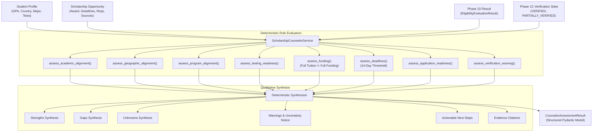

# Phase 1E Implementation Report — Qualitative Scholarship Counselor Module

**Project:** Scholarship Discovery, Verification & Counselor Platform  
**Phase:** 1E (Qualitative Scholarship Counselor Module)  
**Status:** `READY_FOR_PHASE_1F`  
**Date:** September 2026  
**Governing Standard:** `Antigravity — Phase 1E Production Implementation Prompt.md`

---

## 1. Executive Summary

Phase 1E implements the **Qualitative Scholarship Counselor Module**, providing deterministic, explainable, evidence-backed qualitative guidance for international undergraduate applicants.

The module answers five foundational student questions without ever resorting to black-box machine learning, probabilistic scores, or fabricated assumptions:
1. **Relevance & Strengths:** *"Why is this scholarship relevant to me, and what are my strongest alignments?"*
2. **Missing Facts & Requirements:** *"What requirements do I already satisfy, and what information is still missing from my profile?"*
3. **Application Readiness:** *"What application materials and standardized tests do I need to prepare?"*
4. **Funding Breakdown:** *"What does the award actually cover (tuition vs. living expenses), and is it renewable?"*
5. **Actionable Next Steps:** *"What concrete actions should I take next, and which deadlines are approaching?"*

### Absolute Invariants Enforced
- **Eligibility $\ne$ Competitiveness $\ne$ Fit $\ne$ Readiness:** A student may be 100% eligible yet have limited program fit or need test preparation. These dimensions are never conflated into a single metric.
- **Zero Numerical Scoring:** No `match_score`, `fit_score`, `competitiveness_score`, `readiness_score`, `confidence_score`, or `trust_score`.
- **Zero Probability Predictions:** No acceptance chances (e.g. "80% chance of winning") or top-X rankings.
- **Zero LLM / Vector Dependencies:** Pure deterministic Python logic using domain models and Pydantic schemas.
- **Full Tuition $\ne$ Full Funding:** If room, board, and living expenses are not verified as covered, the system explicitly prohibits calling an award "fully funded" and issues a mandatory budget notice.
- **Preservation of `UNKNOWN`:** Missing student facts or unconfirmed provider criteria are never treated as negative disqualifications or assumed positive values.
- **Source Traceability:** Every factual finding cites source authority and verbatim evidence snippets.

---

## 2. Architecture & Module Structure

The counselor sits downstream of Phase 1D Eligibility Evaluation and Phase 1C Verification:



### Module Organization
- `scholarship_intelligence/domain/enums.py`: Core qualitative classifications (`AlignmentLevel`, `ReadinessLevel`, `DeadlineReadiness`).
- `scholarship_intelligence/counselor/enums.py`: Re-exports domain counselor enums for client convenience.
- `scholarship_intelligence/schemas/counselor.py`: Pydantic V2 context schemas and canonical output container `CounselorAssessmentResult`.
- `scholarship_intelligence/counselor/rules.py`: Independent, inspectable, deterministic assessment rules for each counselor dimension.
- `scholarship_intelligence/counselor/service.py`: Orchestrator synthesizing multi-dimensional evaluations, warnings, and provenance references.
- `scholarship_intelligence/counselor/__init__.py`: Public package interface exposing `ScholarshipCounselorService` and result schemas.

---

## 3. The Seven Assessment Dimensions

### 1. Academic Alignment
Evaluates GPA context against minimum thresholds and academic rigor indicators:
- `STRONG`: Student GPA $\ge$ published requirement by $\ge 0.2$ grade points (on a 4.0 scale), or $\ge 3.8$ when no explicit minimum is published.
- `MODERATE`: Student GPA meets or slightly exceeds minimum threshold ($0.0 \le \Delta < 0.2$).
- `LIMITED`: Student GPA is below published minimum criterion.
- `UNKNOWN`: Student GPA or grade scale is unrecorded.
- `NOT_ASSESSABLE`: Opportunity has no academic GPA criteria.

### 2. Geographic Alignment
Evaluates citizenship, nationality, and residency criteria:
- `STRONG`: Student citizenship/residence is explicitly verified in targeted geographic categories.
- `MODERATE`: Student meets general international eligibility, but is not in a specifically targeted priority country.
- `LIMITED`: Student citizenship is excluded or outside permitted countries.
- `UNKNOWN`: Student country of citizenship or residence is unprovided.
- `NOT_ASSESSABLE`: Opportunity is open globally with zero geographic restrictions.

### 3. Program of Study Alignment
Evaluates intended major against eligible university disciplines:
- `STRONG`: Declared major directly matches targeted eligible fields of study.
- `MODERATE`: Major belongs to a broader relevant department or related field.
- `LIMITED`: Declared major is outside published eligible fields.
- `UNKNOWN`: Declared major is unrecorded or opportunity restricts majors but details require clarification.
- `NOT_ASSESSABLE`: Opportunity is open across all fields of study; no major restrictions.

### 4. Testing Readiness
Evaluates standardized tests (SAT/ACT) and English language exam preparedness:
- `READY`: Required exams completed with competitive scores ($\text{SAT} \ge 1400$ or $\text{ACT} \ge 30$).
- `PARTIALLY_READY`: Exam scores recorded meeting baseline criteria, with recommendation to review score competitiveness.
- `NEEDS_PREPARATION`: Standardized testing required by provider, but no scores exist on student profile.
- `UNKNOWN`: Provider testing requirement status is unstated or under review.
- `NOT_APPLICABLE`: Standardized testing is not required (e.g. test-free or test-optional).

### 5. Funding Breakdown & Invariant
Decomposes award packages into tuition, fees, room, meals, stipend, health insurance, and books:
- **Strict Invariant:** If `funding_classification == FULL_TUITION` or tuition is 100% covered while room/meals/stipend are unverified, the system:
  1. Labels award as `FULL_TUITION`, **NEVER** `FULL_FUNDING`.
  2. Generates an explicit summary: *"Full tuition only: Tuition is covered. Room, meals, and living expenses are NOT verified as covered; student must plan for living costs."*
  3. Appends a mandatory funding warning alerting the student to verify room and board costs.

### 6. Application Materials Readiness
Catalogs application requirements (essays, recommendation letters, portfolio, CSS Profile, ISFAA, transcripts):
- `READY`: All required materials prepared or no supplementary materials published.
- `PARTIALLY_READY`: Substantial portfolio assembled with minor items pending.
- `NEEDS_PREPARATION`: One or more mandatory documents (e.g. transcripts, recommendations, personal statement) required.
- `NOT_APPLICABLE`: Opportunity has no required application documentation published.

### 7. Deadline Assessment
Evaluates multiple application and financial aid deadlines independently without collapsing distinct deadlines into a single date:
- Deterministic closing-soon threshold: **14 days** ($0 \le \text{days remaining} \le 14 \implies \text{CLOSING\_SOON}$).
- States: `OPEN`, `CLOSING_SOON`, `UPCOMING`, `CLOSED`, `UNKNOWN`.
- Tracks `has_passed_deadline` and surfaces the earliest upcoming active deadline.

---

## 4. Verification & Uncertainty Handling

The counselor explicitly factors in the verification integrity from Phase 1C and Phase 1D:

1. **Fully Verified Opportunities (`VERIFIED`):**
   - No verification warning is emitted.
   - `evaluation_contains_unverified_facts` is `False`.
2. **Partially Verified Opportunities (`PARTIALLY_VERIFIED`):**
   - `evaluation_contains_unverified_facts` is set to `True`.
   - Generates an explicit high-visibility warning:
     > *"Caution: This evaluation relies in part on unverified or partially verified scholarship information. Confirm all criteria with the official university source."*
   - Appends a mandatory action item recommending verification with the official scholarship provider before applying.
3. **Quarantined / Unverified Opportunities:**
   - Evaluated under strict review notice warning students not to rely on unconfirmed requirements.

---

## 5. Golden Test Cases Verification

All eight golden test scenarios required by the production specification were implemented in `tests/test_counselor_golden_cases.py` and passed with 100% compliance:

| Case | Scenario | Expected Counselor Output | Test Status |
|---|---|---|---|
| **Case A** | Strong alignment across all dimensions | Status `ELIGIBLE`, high academic/geographic alignment, complete funding breakdown, 0 unverified warnings | **PASSED** |
| **Case B** | Hard ineligible student (GPA below minimum) | Status `INELIGIBLE`, explicit gap identifying GPA shortfall, warning advising against application | **PASSED** |
| **Case C** | Sparse student profile (missing GPA, major) | Status `NEEDS_INFORMATION`, preserved `UNKNOWN` states, actionable next step to complete profile | **PASSED** |
| **Case D** | Full tuition award vs. Full funding | Classified as `FULL_TUITION`, living expenses `UNKNOWN`, explicit living cost warning generated | **PASSED** |
| **Case E** | Deadline closing within 7 days | Earliest deadline flagged as `CLOSING_SOON`, days remaining indicated, urgent deadline warning | **PASSED** |
| **Case F** | Partially verified opportunity | `evaluation_contains_unverified_facts = True`, explicit verification warning emitted | **PASSED** |
| **Case G** | Multiple distinct deadlines | Both application and financial aid deadlines preserved independently with separate metadata | **PASSED** |
| **Case H** | Standardized test gap (SAT required, missing) | Testing readiness `NEEDS_PREPARATION`, actionable next step advising SAT/ACT registration | **PASSED** |

---

## 6. Determinism & Safety Verification

1. **100-Run Deterministic Reproducibility (`tests/test_counselor_determinism.py`):**
   - The counselor was executed 100 consecutive times with identical input objects.
   - Outputs across all 100 runs were verified to produce identical JSON representations with zero drift or stochastic ordering.
2. **AST Static Code Analysis (`tests/test_counselor_safety.py`):**
   - `scholarship_intelligence/counselor/` was parsed via Python `ast` to ensure zero usage of `eval()`, `exec()`, `compile()`, `__import__`, or LLM client libraries (`openai`, `anthropic`, `google.generativeai`).
   - `CounselorAssessmentResult` and all child models were verified to contain **zero** forbidden score fields (`match_score`, `fit_score`, `competitiveness_score`, `readiness_score`, `confidence_score`, `trust_score`, `acceptance_probability`).

---

## 7. Complete Test Suite Execution

All 172 tests in the repository passed without a single failure or warning:

```bash
$ .venv/bin/pytest -v
============================= 172 passed in 3.15s ==============================
```

---

## 8. Deferred Work & Absolute Boundary

The following areas are intentionally and strictly deferred to Phase 1F or Phase 2+:
- **Phase 1F:** Benchmark evaluation suite, synthetic corner cases, and stress validation.
- **Phase 2 (UI):** Web application frontend, interactive counselor dashboard, student profile editor.
- **FastAPI Endpoints:** Counselor REST endpoints (`POST /api/v1/counselor/evaluate`).
- **Application Tracking:** Active deadline reminder queues, student document uploads, counselor chat.

---

## 9. Gate Stop & Verification Sign-Off

- **Current Git Branch:** `main`
- **Phase 1E Status:** `COMPLETE`
- **Overall System Status:** `READY_FOR_PHASE_1F`
- **Stop Condition:** Antigravity has completed all Phase 1E requirements and halted at the Phase 1F boundary awaiting explicit user instructions.
