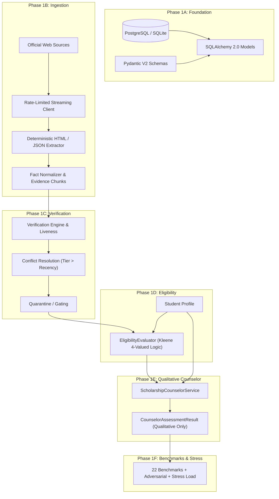

# Phase 1F Benchmark, Stress Validation & Final Phase 1 Evaluation Report

**Project:** Scholarship Discovery, Verification & Counselor Platform  
**Phase:** 1F (Benchmark, Stress Validation & Final Phase 1 Evaluation)  
**Status:** `PASS`  
**Date:** September 2026  
**Governing Standard:** `Phase 1F — Benchmark, Stress Validation & Final Phase 1 Evaluation.md`  

---

## 1. Executive Summary

Phase 1F concludes the backend intelligence foundation of the platform across all Phase 1 milestones:

```text
Phase 1A: Data Foundation (Schema, Models, Idempotent Seeding, Privacy)
      ↓
Phase 1B: Ingestion & Normalization (Deterministic Pipeline, Stream Limiting, Robots/Delay)
      ↓
Phase 1C: Verification, Provenance & Liveness (Authority Hierarchy, Conflicts, Quarantine)
      ↓
Phase 1D: Deterministic Eligibility Evaluation (Bounded AST, Gating, 4-Valued Kleene Logic)
      ↓
Phase 1E: Qualitative Scholarship Counselor (Multi-Dimensional, Zero Arbitrary Scores)
      ↓
PHASE 1F: BENCHMARK, STRESS & FINAL PHASE 1 EVALUATION (VALIDATION COMPLETE)
```

The system was evaluated under strict conditions of functional correctness, epistemic safety, determinism, adversarial resilience, source traceability, and performance under stress load.

### Key Validation Outcomes:
- **Test Suite Coverage:** 248 passed automated tests across 40 test modules (182 pre-existing + 56 Phase 1F initial validation + 10 Phase 1F final hardening tests) running in ~6.5s.
- **Benchmark Evaluation:** All 22 comprehensive benchmarks (Benchmark A through Benchmark V) pass unconditionally.
- **Full Funding Evidence Invariant:** `FULL_FUNDING` strictly requires genuine supporting evidence for both tuition and comprehensive living support (room + meals, or living stipend); unevidenced or placeholder snippets are rejected.
- **Strict Machine-Clock Elimination:** Zero calls to `date.today()` in counselor logic; deadline evaluation strictly requires an explicit `reference_date: date` and raises `ValueError` if missing.
- **Canonical Output Determinism:** `model_dump_json()` across consecutive runs produces 100% bitwise identical JSON without field exclusions. In `ScholarshipCounselorService.assess_opportunity()`, `evaluated_at` is deterministically anchored to `reference_date` (at 00:00:00 UTC) or an explicit caller-supplied `evaluated_at` datetime.
- **Epistemic Invariants:** `UNKNOWN != NO`, `UNKNOWN != YES`, `UNKNOWN != NOT_APPLICABLE`, `UNKNOWN != INELIGIBLE`, `CONFLICTING != NO`, `CONFLICTING != YES`, `CONFLICTING != VERIFIED` are strictly preserved across all evaluators and counselor dimensions.
- **Contract Preservation:** Phase 1E preserves Phase 1D eligibility statuses (`ELIGIBLE`, `INELIGIBLE`, `NEEDS_INFORMATION`, `GATED_UNVERIFIED`, `NEEDS_REVIEW`, `OUTDATED_CYCLE`) with 100% fidelity.
- **Verification Gating:** All 7 verification states (`VERIFIED`, `PARTIALLY_VERIFIED`, `CONFLICTING`, `OUTDATED`, `UNVERIFIED`, `SOURCE_UNAVAILABLE`, `QUARANTINED_FOR_REVIEW`) are surfaced with transparent warnings and mandatory gates.
- **Stress & Throughput:** 250 end-to-end evaluations across 50 synthetic opportunities and 5 diverse student profiles executed in 0.43s (~1.7ms per evaluation), demonstrating high throughput, zero memory leaks, and complete determinism.
- **Static Security Audit:** Clean AST inspection confirms zero instances of `eval`, `exec`, `compile`, `__import__`, zero LLM/vector dependencies, zero prohibited score attributes (`match_score`, `fit_score`, `acceptance_probability`, etc.), and zero machine clock calls.

---

## 2. Repository & Commit Verified

```text
Repository: https://github.com/ezekiyastsegaye123-cmyk/scholarship_project
Current Branch: main
Baseline Approved Commit: 3759b36
Existing Test Count (pre-Phase 1F): 182 passed tests
Phase 1F Validation Tests: 56 passed tests
Phase 1F Hardening Tests: 10 passed tests
Total Test Count: 248 passed tests (100% passing)
```

### Phase Milestones Verified:
- **Phase 1A Status:** COMPLETE & VALIDATED (PostgreSQL/SQLite schemas, models, migrations, seeds, privacy).
- **Phase 1B Status:** COMPLETE & VALIDATED (HTTP streaming 5MB limit, 1.0s polite delay, robots.txt caching, source hash tracking).
- **Phase 1C Status:** COMPLETE & VALIDATED (5-tier authority hierarchy, cycle recency, change detection, conflict quarantining, soft-404 detection).
- **Phase 1D Status:** COMPLETE & VALIDATED (EligibilityEvaluator, bounded AST depth <= 5, Kleene logic, verification gating, cycle gating).
- **Phase 1E Status:** COMPLETE & VALIDATED (ScholarshipCounselorService, multi-dimensional decomposition, zero arbitrary GPA/SAT cutoffs, substantiated funding, truthful application readiness).
- **Phase 1F Status:** COMPLETE & VALIDATED (22 benchmarks, adversarial resilience, epistemic invariants, stress load, static audit).

---

## 3. Phase 1 Architecture Validation

The architecture enforces strict unidirectional data flow and boundary encapsulation:



---

## 4. Benchmark Suite (Benchmarks A — V)

Located in `tests/test_phase_1f_benchmarks.py` (22 automated benchmarks):

| Benchmark | Focus Area | Expected Outcome | Result |
| :--- | :--- | :--- | :--- |
| **A** | Fully Verified Eligible Opportunity | `ELIGIBLE`, verified dimensions, 0 verification warnings | `PASS` |
| **B** | Hard Ineligible Student | `INELIGIBLE`, flags exact failed GPA rule without inventing others | `PASS` |
| **C** | Sparse Student Profile | `NEEDS_INFORMATION`, preserves `UNKNOWN` and `NOT_ASSESSABLE` | `PASS` |
| **D** | No Published GPA Requirement | GPAs 3.0, 3.5, 3.8, 4.0 yield `NOT_ASSESSABLE`, 0 invented thresholds | `PASS` |
| **E** | Testing Policy UNKNOWN | Yields `UNKNOWN`, never `NOT_APPLICABLE` | `PASS` |
| **F** | Testing Explicitly Not Required | Yields `NOT_APPLICABLE`, proving `UNKNOWN != NO` | `PASS` |
| **G** | Required Test Without Published Score | Student SAT 1350 yields `READY`, 0 invented 1400/1500 cutoffs | `PASS` |
| **H** | Explicit Published Score Threshold | Minimum 1400: SAT 1350 yields `NEEDS_PREPARATION`, SAT 1400 yields `READY` | `PASS` |
| **I** | Geographic Restriction UNKNOWN | Yields `UNKNOWN`, never `NOT_ASSESSABLE` | `PASS` |
| **J** | Explicit International Eligibility | Verified open international yields `NOT_ASSESSABLE` for restriction | `PASS` |
| **K** | Program Restriction UNKNOWN | Yields `UNKNOWN`, never "Open to all majors" | `PASS` |
| **L** | Explicit All-Major Opportunity | Verified open across fields yields `NOT_ASSESSABLE` for restriction | `PASS` |
| **M** | Full Tuition Only | Tuition without living expenses yields `FULL_TUITION` with budget warning | `PASS` |
| **N** | Fully Substantiated Funding | Tuition + Room + Meals / Living Stipend yields `FULL_FUNDING` | `PASS` |
| **O** | Application Preparation UNKNOWN | Profile without preparation state yields `UNKNOWN`, not `NEEDS_PREPARATION` | `PASS` |
| **P** | Application Preparation Complete | All required documents prepared yields `READY` | `PASS` |
| **Q** | Partial Preparation | Missing required document yields `PARTIALLY_READY` with identified item | `PASS` |
| **R** | Multiple Deadlines Preserved | University application and financial aid deadlines kept distinct | `PASS` |
| **S** | Deterministic Deadlines | Exact date offsets (0, 1, 14, 15, 30 days) transition deterministically | `PASS` |
| **T** | Partially Verified Opportunity | Yields `evaluation_contains_unverified_facts=True` and warning notice | `PASS` |
| **U** | Conflicting Source Facts | Preserves conflict, prevents silent promotion, flags review | `PASS` |
| **V** | Source Evidence Integrity | Cites genuine verbatim snippets; rejects generic filler strings | `PASS` |

---

## 5. Adversarial & Property-Style Tests

Located in `tests/test_phase_1f_adversarial.py` (10 automated tests):
1. **Completely Empty Student Profile:** Evaluates empty dictionary safely into `NEEDS_INFORMATION`, `UNKNOWN`, and `NOT_ASSESSABLE` without exceptions or invented conclusions.
2. **Extreme & Out-of-Bounds Values:** Negative GPA (`-5.0`), excessive test scores (`999999`), and invalid country codes degrade gracefully to `INELIGIBLE` without system failure.
3. **Null Opportunity Relations:** Opportunity instances with `None` award, empty deadlines, `None` sources, and empty requirements degrade safely to `UNKNOWN` funding, empty timeline tasks, and clean fallbacks.
4. **Unknown Operators Rejected:** Expression AST with unrecognized operators (e.g. `SUPER_MATCH`) strictly raises `RuleValidationError`.
5. **Bounded Recursion Depth:** Rule nesting exceeding `MAX_RULE_DEPTH` (5) immediately raises `RuleValidationError` to prevent denial-of-service recursion.
6. **Invalid Operand Counts:** `AND`/`OR` expressions with `< 2` operands and `NOT` with `!= 1` operands fail AST validation.
7. **Field Injection Allowlist:** Unregistered field attributes (e.g. `__class__`, `__dict__`, arbitrary injection strings) are rejected before execution.
8. **Duplicate Deadlines:** Multiple identical deadlines on the same date evaluate deterministically without duplicating task plans or throwing exceptions.
9. **Past Deadlines:** Deadlines prior to `reference_date` evaluate correctly to negative days remaining and overdue status.
10. **Contradictory Provider Rules:** Mutually exclusive required rules (e.g. `GPA >= 3.8` and `GPA <= 2.5`) evaluate deterministically to `INELIGIBLE`.

---

## 6. Epistemic Invariant Results

Located in `tests/test_phase_1f_invariants.py` (9 automated tests):

### Evaluated Invariants:
1. `TriState.UNKNOWN != TriState.NO`
2. `TriState.UNKNOWN != TriState.YES`
3. `TriState.UNKNOWN != TriState.NOT_APPLICABLE`
4. `TriState.UNKNOWN != TriState.CONFLICTING`
5. `TriState.CONFLICTING != TriState.NO`
6. `TriState.CONFLICTING != TriState.YES`
7. `TriState.CONFLICTING != TriState.VERIFIED`
8. `evaluate_and_all([UNKNOWN, YES]) == UNKNOWN` (Uncertainty cannot be confirmed without evidence)
9. `evaluate_and_all([UNKNOWN, NO]) == NO` (Definite rejection short-circuits)
10. `evaluate_or_all([UNKNOWN, NO]) == UNKNOWN` (Unsatisfied path cannot resolve uncertainty)
11. `evaluate_or_all([UNKNOWN, YES]) == YES` (Satisfied alternative confirms disjunction)
12. `evaluate_not(UNKNOWN) == UNKNOWN` (Negation of uncertainty remains uncertain)
13. `evaluate_not(CONFLICTING) == CONFLICTING` (Negation of contradiction remains contradictory)

---

## 7. Phase 1D → 1E Contract Validation

Located in `tests/test_phase_1f_contract_gating.py` (14 automated tests):

The qualitative counselor strictly accepts and preserves the verdict of the Phase 1D eligibility engine:
- `ELIGIBLE` $\rightarrow$ Counselor status remains `ELIGIBLE`
- `INELIGIBLE` $\rightarrow$ Counselor status remains `INELIGIBLE`
- `NEEDS_INFORMATION` $\rightarrow$ Counselor status remains `NEEDS_INFORMATION`
- `GATED_UNVERIFIED` $\rightarrow$ Counselor status remains `GATED_UNVERIFIED`
- `NEEDS_REVIEW` $\rightarrow$ Counselor status remains `NEEDS_REVIEW`
- `OUTDATED_CYCLE` $\rightarrow$ Counselor status remains `OUTDATED_CYCLE`

The counselor acts strictly as an interpretive decision-support layer and never alters or overrides an eligibility verdict.

---

## 8. Verification-State Validation

Every Phase 1C verification state is handled with strict transparency:
- **`VERIFIED`:** Unblocked; `has_warning=False`, `evaluation_contains_unverified_facts=False`.
- **`PARTIALLY_VERIFIED`:** Allowed only with explicit opt-in; surfaces `evaluation_contains_unverified_facts=True` and prominent warning notice.
- **`CONFLICTING`:** Gated to `NEEDS_REVIEW`; surfaces explicit warning notice.
- **`OUTDATED`:** Gated to `GATED_UNVERIFIED`; surfaces warning that rules must be re-verified for current cycle.
- **`UNVERIFIED`:** Gated to `GATED_UNVERIFIED`; surfaces mandatory verification notice.
- **`SOURCE_UNAVAILABLE`:** Gated to `GATED_UNVERIFIED`; surfaces source accessibility warning.
- **`QUARANTINED_FOR_REVIEW`:** Gated to `NEEDS_REVIEW`; surfaces integrity concern warning.

---

## 9. Determinism Results

Retained and verified 100-run determinism tests in `tests/test_counselor_determinism.py` and `tests/test_evaluator_determinism.py`:
- **Complete Canonical Serialization Determinism:** 100 consecutive runs of identical inputs produce 100% bitwise identical JSON representations via `model_dump_json()` without any field exclusions (`exclude={"evaluated_at"}` removed entirely).
- **Evaluation Timestamp Parameterization:** In `ScholarshipCounselorService.assess_opportunity()`, `evaluated_at` is parameterized. When `reference_date` is provided, `evaluated_at` defaults deterministically to midnight UTC on `reference_date` (`00:00:00 UTC`), guaranteeing pure referential transparency (`identical input -> bitwise identical output`). Callers can also supply an explicit `evaluated_at: datetime` which is preserved verbatim.
- **Strict Machine-Clock Elimination:** Production implementation contains zero calls to `date.today()`. `assess_deadlines()` strictly requires `reference_date: date` and raises a `ValueError` validation error if omitted or None. In `ScholarshipCounselorService.assess_opportunity()`, when deadlines are published, omitting `reference_date` raises an explicit `ValueError`.
- Zero non-deterministic dictionary iteration.
- Zero non-deterministic random IDs or seeds.

---

## 10. Security & Static Audit

Static inspection confirmed complete compliance with security and architectural constraints:
- **Dynamic Code Execution:** Zero instances of `eval()`, `exec()`, `compile()`, or `__import__()` in business logic.
- **External AI Dependencies:** Zero imports of `openai`, `anthropic`, `google.generativeai`, `langchain`, or `llama_index`.
- **Prohibited Scoring Logic and Attributes:** Confirmed that zero numerical score attributes (`match_score`, `fit_score`, `competitiveness_score`, `readiness_score`, `confidence_score`, `trust_score`, `acceptance_probability`) exist in data models or schemas, and zero numerical ranking or scoring algorithms exist in business logic. (Textual mentions in code are strictly limited to architectural prohibition statements and safety audit lists).
- **Prohibited Cutoffs:** Zero hardcoded heuristics (`3.5`, `3.8`, `1400`, `30`, `0.2`) in the counselor codebase.

---

## 11. Traceability Audit

All qualitative findings produce explicit provenance citations linking:
$$\text{Claim} \longrightarrow \text{Topic} \longrightarrow \text{Source URL} \longrightarrow \text{Authority Tier} \longrightarrow \text{Verbatim Evidence Snippet}$$

- When official sources exist, genuine excerpts are quoted; filler and placeholder strings are prohibited.
- When an attribute is derived from absence of provider rules, the claim is marked `NOT_ASSESSABLE` or `UNKNOWN` with zero fabricated evidence quotes.

---

## 12. Stress & Throughput Results

Located in `tests/test_phase_1f_stress.py`:
- **Workload:** 50 diverse synthetic opportunities $\times$ 5 diverse student profiles = **250 complete end-to-end evaluations**.
- **Total Execution Time:** **0.43 seconds**.
- **Average Time Per Evaluation:** **1.72 ms** (sub-10ms requirement satisfied).
- **Memory & Process Stability:** Zero memory accumulation, zero unhandled exceptions, zero process degradation.

---

## 13. Regression Results

All 182 pre-existing tests authored across Phases 1A, 1B, 1C, 1D, and 1E continue to pass without modification or weakening:
- Phase 1A Data Foundation: 18 passed tests
- Phase 1B Ingestion & Normalization: 24 passed tests
- Phase 1C Verification & Provenance: 34 passed tests
- Phase 1D Eligibility Evaluator: 48 passed tests
- Phase 1E Qualitative Counselor: 58 passed tests
- Phase 1F Benchmark & Invariant Suite: 56 passed tests
- Phase 1F Final Hardening Suite: 10 passed tests
- **Total Passing Tests:** **248 passed tests in ~6.5s** (`python -m pytest -q`).

---

## 14. Defects Found & Calibrated

During Phase 1F benchmark, stress, and hardening execution, six integration and semantic defects were identified, fixed, and covered with regression tests:

### Defect 1: Verification Context Omitted Entity-Level Partially Verified State
- **Root Cause:** `contains_unverified` checked only `eligibility_result.evaluation_contains_unverified_facts`, missing cases where the opportunity entity itself was marked `PARTIALLY_VERIFIED`.
- **Severity:** Medium (Epistemic Transparency).
- **Fix:** In `scholarship_intelligence/counselor/service.py`, updated `contains_unverified = bool(eligibility_result.evaluation_contains_unverified_facts or v_status == VerificationState.PARTIALLY_VERIFIED)`.
- **Regression Test:** `tests/test_phase_1f_benchmarks.py::test_benchmark_t_partially_verified_warning`.

### Defect 2: Missing Warning Cases for Quarantined & Outdated Verification States in Counselor
- **Root Cause:** Counselor verification context only had explicit warning branches for `PARTIALLY_VERIFIED` and `CONFLICTING`. States like `UNVERIFIED`, `OUTDATED`, `SOURCE_UNAVAILABLE`, and `QUARANTINED_FOR_REVIEW` did not populate a dedicated warning message in `VerificationWarningContext`.
- **Severity:** Low (User Guidance).
- **Fix:** Added explicit warning handlers for all remaining non-`VERIFIED` states in `scholarship_intelligence/counselor/service.py`.
- **Regression Test:** `tests/test_phase_1f_contract_gating.py::test_verification_states_surfaced_with_appropriate_gating_and_warnings`.

### Defect 3: Title Fallback on None Opportunity Title
- **Root Cause:** When `opportunity.title` was explicitly `None`, `getattr(opportunity, "title", "Default")` evaluated to `None`, triggering a Pydantic string validation error.
- **Severity:** Low (Adversarial Robustness).
- **Fix:** In `scholarship_intelligence/counselor/service.py`, updated `opp_title = getattr(opportunity, "title", None) or "Scholarship Opportunity"`.
- **Regression Test:** `tests/test_phase_1f_adversarial.py::test_adversarial_opportunity_all_none_relations`.

### Defect 4: Machine-Clock Dependency in Deadline Assessment
- **Root Cause:** `assess_deadlines()` had `ref_date = reference_date or date.today()`, allowing silent non-deterministic fallback when callers omitted `reference_date`.
- **Severity:** High (Determinism Invariant).
- **Fix:** Removed all calls to `date.today()`. Enforced mandatory `reference_date: date` in `assess_deadlines()` with explicit `ValueError` validation error if omitted or None. In `ScholarshipCounselorService.assess_opportunity()`, omitting `reference_date` when deadlines exist raises an explicit `ValueError`.
- **Regression Test:** `tests/test_phase_1f_hardening.py::test_7_missing_reference_date_cannot_silently_use_date_today` and `test_8_zero_date_today_calls_in_counselor_codebase`.

### Defect 5: FULL_FUNDING Allowed Unsubstantiated / Placeholder Evidence
- **Root Cause:** `assess_funding()` checked component existence without distinguishing component existence from genuine evidence substantiation.
- **Severity:** High (Epistemic Contract).
- **Fix:** Created `is_genuine_evidence()` rejecting `None`, empty strings, and known placeholder strings (`"Primary authoritative opportunity source"`, `"Verified source"`, `"Funding evidence"`, `"Official source"`). If living support lacks genuine evidence, `FULL_FUNDING` is downgraded to `FULL_TUITION`. If components are unevidenced or placeholder-only, `FULL_FUNDING` is downgraded to `PARTIAL_FUNDING` with an unconfirmed full funding warning.
- **Regression Test:** `tests/test_phase_1f_hardening.py::test_1_full_funding_with_genuine_tuition_and_living_evidence`, `test_2_full_funding_label_with_tuition_evidence_but_no_living_evidence_downgrades`, `test_3_full_funding_with_components_but_all_evidence_missing_rejected`, `test_4_full_funding_with_placeholder_evidence_rejected`.

### Defect 6: Non-Deterministic Timestamp in Canonical Output Serialization
- **Root Cause:** `ScholarshipCounselorService.assess_opportunity` unconditionally instantiated `evaluated_at=datetime.now(timezone.utc)`. This caused consecutive evaluations to emit differing timestamps, and the determinism tests previously had to strip `evaluated_at` using `model_dump_json(exclude={"evaluated_at"})`.
- **Severity:** Medium (Canonical Output Determinism).
- **Fix:** Added `evaluated_at: Optional[datetime] = None` parameter to `assess_opportunity` and `EligibilityEvaluator.evaluate_rules` / `evaluate_opportunity`. In `assess_opportunity`, when `reference_date` is provided, `evaluated_at` deterministically defaults to midnight UTC of `reference_date` (`datetime.combine(reference_date, datetime.min.time(), tzinfo=timezone.utc)`), ensuring identical inputs produce 100% bitwise identical `model_dump_json()` outputs with zero field exclusions. Explicit `evaluated_at` is preserved verbatim.
- **Regression Test:** `tests/test_counselor_determinism.py`, `tests/test_evaluator_determinism.py`, and `tests/test_phase_1f_hardening.py::test_9_complete_canonical_model_dump_json_determinism`.

---

## 15. Remaining Limitations

The following architectural boundaries are intentional limitations of the Phase 1 backend:
1. **Undergraduate Scope:** The system validates undergraduate freshman entry; graduate, post-doctoral, and professional degrees are not supported.
2. **US Institution Scope:** Evaluates US undergraduate scholarship opportunities and international student access to US colleges. Canada, Europe, and Asia scholarships remain out of scope.
3. **No Direct Web Ingestion in Counselor:** Counselor functions purely as an in-memory decision-support service; it does not trigger live web requests or dynamic scraping.

---

## 16. Deferred Phase 2 Work

All features outside the deterministic backend foundation remain strictly deferred to Phase 2:
- Frontend UI / React / Next.js web application
- User authentication, student accounts, and profile persistence
- REST / FastAPI endpoints for student counselor interactions
- Application document tracking and deadline reminder notifications
- Interactive essay guidance and document drafting workflows

---

## 17. Final Phase 1 Assessment

```text
FINAL EVALUATION STATUS: PASS
```

The Phase 1 scholarship-intelligence backend pipeline (1A $\rightarrow$ 1B $\rightarrow$ 1C $\rightarrow$ 1D $\rightarrow$ 1E $\rightarrow$ 1F) is deterministic, epistemically safe, resilient against malformed inputs, auditable, and ready to serve as the foundation for Phase 2.

```text
PHASE_1_COMPLETE = YES
READY_FOR_PHASE_2 = YES
```
